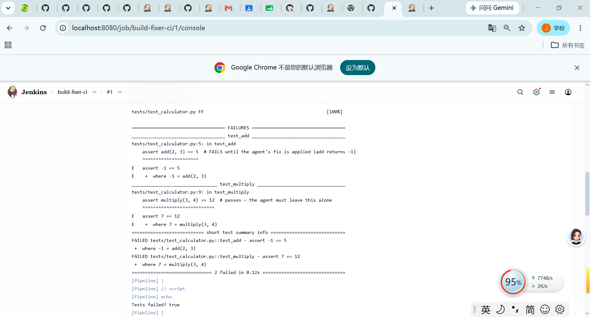
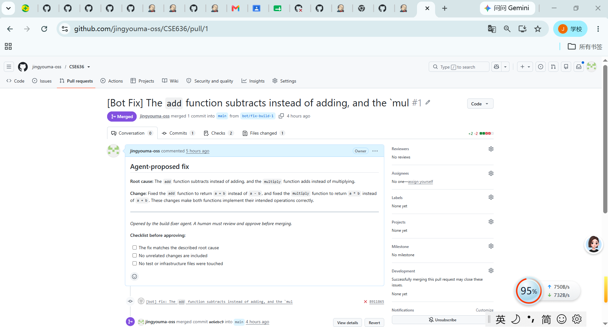
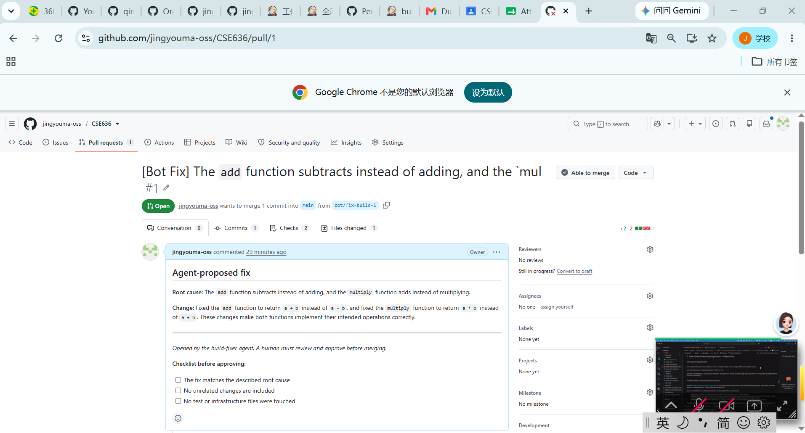
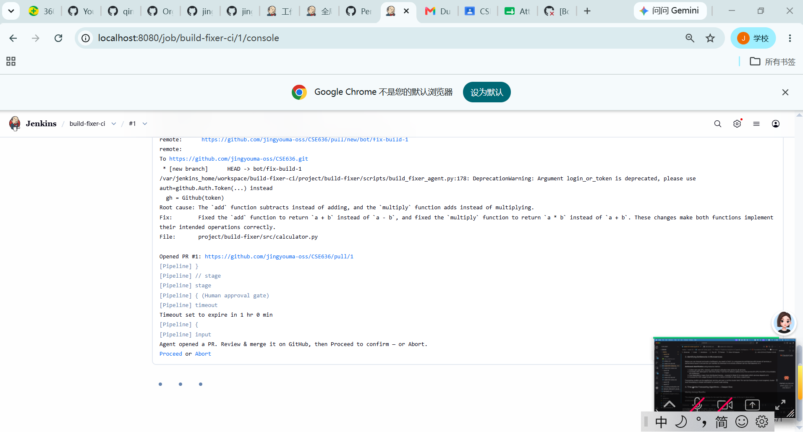
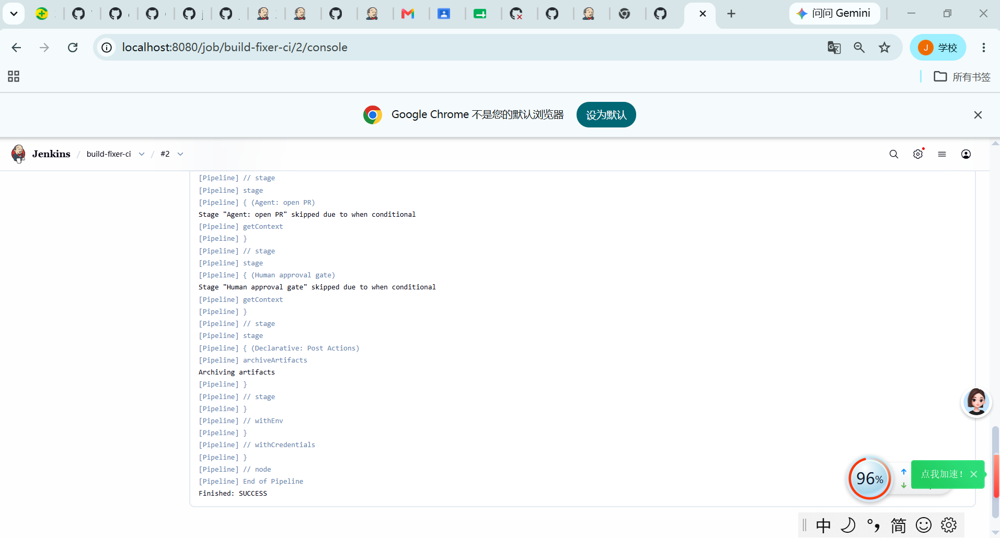
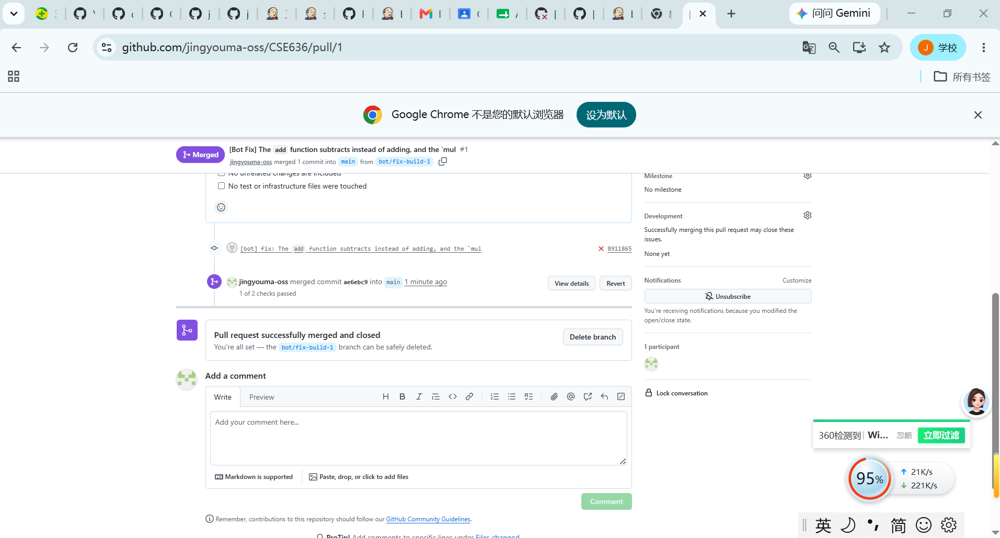

# Lab Deliverable — Build-Fixer Agent with Human Approval Gate

**Author:** Jingyou Ma

## 1. The failure

`project/build-fixer/src/calculator.py` contains two intentional bugs:
`add()` uses subtraction instead of addition, and `multiply()` uses
addition instead of multiplication. Running the pipeline against this
code produces a red build:

## 2. The agent's PR

The build-fixer agent (`scripts/build_fixer_agent.py`) read the failing
build log plus `calculator.py`, and opened
[PR #1](https://github.com/jingyouma-oss/CSE636/pull/1) with this analysis:

- **Root cause:** "The `add` function subtracts instead of adding, and
  the `multiply` function adds instead of multiplying."
- **Fix:** "Fixed the `add` function to return `a + b` instead of
  `a - b`, and fixed the `multiply` function to return `a * b` instead
  of `a + b`. These changes make both functions implement their intended
  operations correctly."

**Was it accurate?** Yes. Checking the diff confirms the agent changed
exactly the two broken lines and nothing else — no test files, no
unrelated code:

## 3. The approval-gate pause

The pipeline paused at the `Human approval gate` stage, waiting on a
Jenkins `input` step wrapped in a 60-minute `timeout`:

After reviewing the PR, I clicked **Proceed** in Jenkins. The console log
records exactly who approved it, not an automated pass:

I then merged the PR myself on GitHub — the agent's token never had merge
permission, only the ability to open the PR:

## 4. What I'd change

One concrete change to the agent's prompt: the system prompt tells the
model to change "exactly one file" but doesn't require it to explain
*why* it left other similar-looking functions untouched. In this repo,
`multiply` needed a fix too (it had the *opposite* bug — addition instead
of multiplication), and the agent correctly caught both because they were
both covered by failing tests. But if a similarly-shaped function existed
*without* a failing test, the agent has no obligation to flag it as
suspicious. I'd add a line like *"If other functions contain similar
code, state in `fix_description` whether they were checked and why they
were or weren't changed"* — this turns a silent decision into a visible,
reviewable one.

On the guardrail side: the approval gate worked exactly as designed — the
job genuinely paused (not just visually), and the log line "Approved by
Jingyou Ma" is concrete proof that a human, not a timer, allowed it to
proceed. The one gap I'd close next is that this is currently verified
manually (I confirm each time that Proceed required a real click); a
stronger version would have a periodic check that attempts to bypass the
gate and asserts it's rejected, so the guardrail is continuously verified
rather than trusted by convention.
