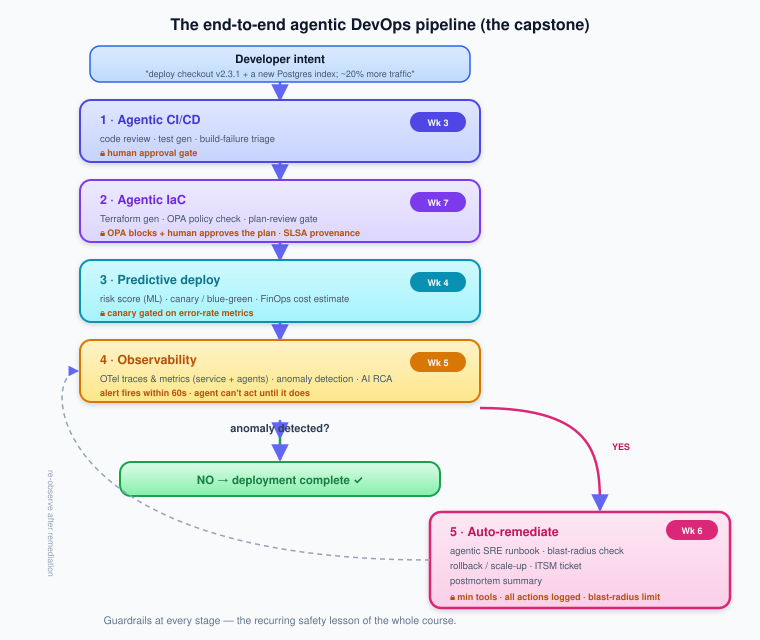

# CSE636 — Group Project, Capstone & Exam Guide

A single front door for the graded work that spans the whole course. The
per-week labs and the [Week 7 capstone rubric](week-07/week-07-lab.md#capstone-project-rubric)
remain the detailed source of truth; this guide ties them together so students
(and instructors) can see the whole arc at once.

> **Grading weights (from the [syllabus](../syllabus/CSE636_Syllabus_v2.md)):**
> Mid-term 15% · **Group Project / Capstone 20%** · Case Discussions 30% · Final Exam 20% · Participation 15%.

---

## 1. The Group Project is the Capstone

The 20% "Group Project" **is** the end-to-end agentic DevOps pipeline you assemble
across the course and present in Week 7. You are not starting from scratch in
Week 7 — each week's lab produces a component you'll integrate.

### What you deliver (Week 7)

1. **Code repository** — pipeline, IaC modules, agent configs, OPA policies, observability setup.
2. **15-minute group presentation** — live demo or recorded walkthrough.
3. **Technical report (4–6 pages)** — architecture, guardrails chosen, lessons learned.

Full point breakdown: see the **[Capstone Project Rubric](week-07/week-07-lab.md#capstone-project-rubric)** (100 pts).

---

## 2. Team formation

- **Team size:** 2–4 students (solo allowed with instructor approval; scope expectations are unchanged).
- **Form teams by the end of Week 2**, once everyone has run an agent against a real repo (Week 1 lab) and stood up a pipeline + MCP server (Week 2 lab).
- **Roles rotate, but name an owner per pipeline stage** (CI/CD, IaC, deploy, observability, remediation). Everyone should be able to explain every stage in the presentation.
- **Responsible-AI disclosure is per-team:** state which AI tools you used, for what, and how you verified the output. Undisclosed/unverified AI use is an academic-integrity issue (see syllabus).

---

## 3. Week-by-week build plan

Treat each lab as a capstone increment. By Week 7 you're integrating, not inventing.

| Week | Lab output | Capstone component it becomes |
|---|---|---|
| [1](week-01/week-01-lab.md) | Cloud lab + first agent run; collect CI/metrics data | Baseline environment & the data later stages consume |
| [2](week-02/week-02-lab.md) | Jenkins pipeline + an MCP server | The CI backbone and the agent↔tool plumbing |
| [3](week-03/week-03-lab.md) | Build-fixer agent behind an approval gate | **Stage 1 — Agentic CI/CD** |
| [4](week-04/week-04-lab.md) | Prophet forecast → scaling recommendation | **Stage 3 — Predictive deploy** (risk/canary/FinOps) |
| [5](week-05/week-05-lab.md) | Isolation-forest detector + OTel-instrumented agent | **Stage 4 — Observability** (service + agent telemetry) |
| [6](week-06/week-06-lab.md) | ReAct incident-triage agent + gated remediation | **Stage 5 — Auto-remediate** |
| [7](week-07/week-07-lab.md) | Agent-generated Terraform + OPA gate | **Stage 2 — Agentic IaC** + final integration |

> **Suggested milestones:** components working in isolation by end of Week 6; integrated end-to-end by the Week 7 session; presentation + report finalized for the Week 7 presentation slot.

**Runnable starters** to build on (mirror their quality and structure):
[`project/starter/`](../project/starter/) ·
[`project/Jenkins/`](../project/Jenkins/) ·
[`project/build-fixer/`](../project/build-fixer/) ·
[`project/k8s-demo/`](../project/k8s-demo/) ·
[`project/forecasting/`](../project/forecasting/) ·
[`project/anomaly/`](../project/anomaly/) ·
[`project/iac/`](../project/iac/).

---

## 4. What "excellent" looks like (the through-line)

A strong capstone tells one story across all seven weeks. The single most-rewarded
quality is **guardrails narrated explicitly** — walk the audience through what each
agent *cannot* do and why (least privilege, approval gates, blast-radius limits,
OPA, audit trails). See the [Week 7 presentation guidance](week-07/week-07-lab.md#presentation-guidance).

---

## 5. Exams

| Exam | Weight | Covers | Format | Where to study |
|---|---|---|---|---|
| **Mid-term** | 15% | **Weeks 1–4** | Closed-book, ~60 min: multiple-choice + short-answer + one scenario | The [Week 4 mid-term checkpoint](week-04/week-04-notes.md#mid-term-checkpoint) + each week's 🔑 Key Terms and ✅ checkpoints |
| **Final** | 20% | **Whole course (Weeks 1–7)** | In-class or take-home, per instructor; synthesis questions across stages | The [Week 7 Final Exam Topic Review](week-07/week-07-lab.md#final-exam-topic-review) |

**Highest-yield prep for both:** re-read every week's **🔑 Key Terms** tables and
work the **✅ "Check your understanding"** collapsibles in the notes — they are
written against the same learning objectives the exams test. Expect the final to
ask *synthesis* questions (e.g., "trace the perceive→plan→act→observe loop across
CI/CD, observability, and incident response," or "where does each autonomy level
belong in the capstone pipeline, and why?").

---

## 6. Case discussions (30%, throughout)

Each week's notes end with **💬 Discussion & Case Questions**. These are the basis
for the participation/case-discussion grade. Come having formed a position with
evidence — the rubric rewards reasoning and risk-awareness over "right answers."
