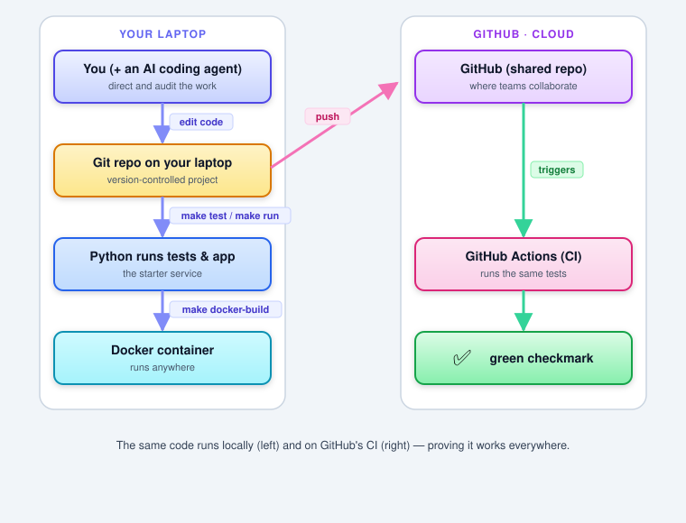

# Week 0: Getting Ready — A Beginner's On-Ramp

> 📝 **Primer notes.** The hands-on setup walkthrough lives in **[week-00-lab.md](week-00-lab.md)**. Do the lab *before* Week 1's first class.

**Theme:** Get every student — including those who have never used Git, Docker, or an AI agent — to the same starting line, with a working toolchain and a shared vocabulary, *before* the course begins in earnest.

**Where this sits in the course arc:** Week 0 is optional-but-strongly-recommended pre-work. It is not graded as heavily as later weeks; its job is to remove setup friction so that in [Week 1](../week-01/week-01-notes.md) you can focus on *concepts* (what DevOps and agents are) instead of fighting with installation. Week 1 re-teaches every concept introduced here in much greater depth — so if something below feels fuzzy, that's fine. This is a first pass.

**What comes next:** [Week 1: Foundations of AI-Assisted & Agentic DevOps](../week-01/week-01-notes.md) goes deep on the DevOps lifecycle, LLMs, and the anatomy of an AI agent.

---

## Why this week exists

The labs in this course move quickly: by Week 4 you'll wire a forecasting model into an autoscaler. If you spend the first two weeks struggling to install Python or understand what a "commit" is, you'll fall behind on the *ideas*, which are the point.

So Week 0 has two goals:

1. **Install and verify the five tools** the course relies on (below), by running one tiny project end to end.
2. **Meet the core words** — repository, commit, container, pipeline, agent — in plain language, so the Week 1 lecture isn't the first time you hear them.

> **You do not need to understand any of this deeply yet.** If you can copy the commands in the [lab](week-00-lab.md) and see green checkmarks, you are ready for Week 1.

---

## 🧱 Foundations Primer (light version)

Each idea below gets one paragraph and an analogy. Week 1 expands all of them.

### 1. A repository, a commit, and a branch (Git & GitHub)

**Git** is a tool that tracks the history of your files — every change, who made it, and when. A folder tracked by Git is a **repository** ("repo"). A **commit** is a saved snapshot of your files at a moment in time, with a short message describing what changed. A **branch** is a parallel line of work; you can experiment on a branch without disturbing the main version, then merge it back when it's ready.

**GitHub** is a website that hosts repositories online so teams can share them. A **pull request (PR)** is how you propose merging your branch into the main one — it's where code review and (later in this course) *AI agents* do their work.

> **Analogy:** Git is the "track changes" and version history of a document, but for an entire project — and far more powerful. GitHub is the shared drive where everyone's copy lives.

### 2. A container (Docker)

A **container** packages your application together with everything it needs to run — the right language version, libraries, and settings — into one portable unit. The same container runs identically on your laptop, a teammate's laptop, and a production server. This kills the classic excuse, *"but it works on my machine."* **Docker** is the most common tool for building and running containers. A **Dockerfile** is the recipe that describes how to build one.

> **Analogy:** A shipping container. It doesn't matter what's inside or which ship/truck/crane handles it — the standardized box fits everywhere. Software containers do the same for code.

### 3. A pipeline and CI/CD

A **pipeline** is an automated assembly line for software. Every time you push code, the pipeline can automatically build it, run the tests, and (eventually) deploy it. **CI** (Continuous Integration) means automatically testing every change as it comes in. **CD** (Continuous Delivery/Deployment) means automatically getting passing changes ready for — or all the way to — production. In this course you'll see CI run on GitHub via **GitHub Actions**: push code, watch a checkmark go green or a red X appear.

> **Analogy:** A factory quality-control line. Each change rides the belt; only the ones that pass every check make it out the door.

### 4. An LLM and an AI agent

A **Large Language Model (LLM)** — like Claude, GPT, or Gemini — is an AI trained on huge amounts of text that can read, write, summarize, and reason about language and code. An **AI assistant** answers your question and stops. An **AI agent** goes further: it can take *actions* — run commands, edit files, open pull requests — in a loop, observing the result of each action and deciding the next step, in pursuit of a goal you gave it.

> **Analogy:** An assistant is a GPS that shows you the route. An agent is a self-driving car that actually takes you there — which is exactly why you watch it carefully.

This single distinction — *assistant answers, agent acts* — is the spine of the entire course.

---

## How the five tools fit together

Here's the whole picture you'll assemble in the [lab](week-00-lab.md):

You will do exactly this with the **starter service** in [`../../project/starter/`](../../project/starter/) — a tiny web app built for this purpose.

---

## The five tools (and why the course needs each)

| Tool | What it is | Why this course uses it |
|---|---|---|
| **Git + a GitHub account** | Version control + online repo hosting | Every lab is code in a repo; agents work through pull requests |
| **Python 3.12+** | The course's programming language | Labs, the starter app, and forecasting/agent code are in Python |
| **Docker Desktop** | Builds and runs containers | Week 1 Docker foundations; later labs run services in containers |
| **An AI coding agent** (Claude Code *or* GitHub Copilot) | An LLM that can act on your repo | The whole point of the course — you'll direct and audit it |
| **A place to run things** (your laptop, GitHub Codespaces, *or* a cloud free tier) | Compute environment | Somewhere to run shell commands and the labs |

> **Lowest-friction path:** If installing things locally is painful, use **GitHub Codespaces** — open the starter folder in the browser and Python + Docker are pre-installed via the included [Dev Container](../../project/starter/.devcontainer/devcontainer.json). The [lab](week-00-lab.md) explains both paths.

---

## ✅ "Am I ready for Week 1?" self-check

You're ready when you can honestly check every box. The [lab](week-00-lab.md) walks you through each one.

- [ ] I have a **GitHub account** and Git works (`git --version`).
- [ ] **Python 3.12+** is installed (`python3 --version`).
- [ ] **Docker** runs (`docker --version`) — *or* I'm using Codespaces.
- [ ] I cloned the course repo and ran the **starter service**: `make setup`, `make test` (all pass), `make run` (I saw `{"status":"ok"}` at `/health`).
- [ ] I pushed the starter to **my own GitHub repo** and saw the **CI checkmark go green**.
- [ ] I installed an **AI coding agent** and gave it one task against the starter repo.
- [ ] I can explain, in one sentence each: *repo, commit, container, pipeline, agent*.

---

## 🔑 Key Terms (Week 0)

| Term | Plain-language definition |
|---|---|
| **Repository (repo)** | A folder whose entire change history is tracked by Git |
| **Commit** | A saved snapshot of your files, with a message describing the change |
| **Branch** | A parallel line of work you can merge back into the main version |
| **Pull request (PR)** | A proposal to merge a branch; where review and AI agents operate |
| **Container** | A portable package of an app plus everything it needs to run |
| **Dockerfile** | The recipe describing how to build a container image |
| **Pipeline** | An automated build → test → deploy assembly line for code |
| **CI/CD** | Continuous Integration / Delivery — auto-test and auto-ship changes |
| **LLM** | Large Language Model — an AI that reads and writes language and code |
| **AI assistant** | Answers your question, then stops; you act |
| **AI agent** | Takes actions in a loop to reach a goal; you supervise |

---

## ⚠️ Common Pitfalls (Week 0)

⚠️ **Skipping Week 0 because "I'll figure it out in class."** Setup problems are the #1 reason students fall behind in week 1. Do this pre-work when there's no time pressure.

⚠️ **Trying to understand everything now.** Week 0 is a *first exposure*, not mastery. If "what's a branch?" still feels hazy after the lab, that's expected — Week 1 teaches it properly.

⚠️ **Installing tools but never verifying them.** "Installed" is not "working." The whole point of the [lab](week-00-lab.md) is to *prove* your toolchain works by running a real project end to end.

⚠️ **Committing secrets.** When you create your GitHub repo, never commit API keys or passwords. The starter's [`.gitignore`](../../project/starter/.gitignore) already excludes `.env`; keep keys there. (Week 2 and Week 7 cover agent secret-handling in depth.)

---

## References

### In this repository

- **Starter service** (the project you'll run): [`../../project/starter/`](../../project/starter/)
- **Full syllabus (v2)**: [`../../syllabus/CSE636_Syllabus_v2.md`](../../syllabus/CSE636_Syllabus_v2.md)
- **Git foundations deck**: [`../../slides/Git.md`](../../slides/Git.md)
- **Docker foundations deck**: [`../../slides/Docker_101.md`](../../slides/Docker_101.md)
- **Week 1 lecture notes** (where the real depth begins): [`../week-01/week-01-notes.md`](../week-01/week-01-notes.md)

### Free, official getting-started guides

- Git basics (Pro Git book, free): https://git-scm.com/book
- GitHub "Hello World" quickstart: https://docs.github.com/en/get-started/quickstart/hello-world
- Docker — get started: https://docs.docker.com/get-started/
- GitHub Codespaces (run in the browser, no local install): https://docs.github.com/en/codespaces
- Python downloads: https://www.python.org/downloads/
