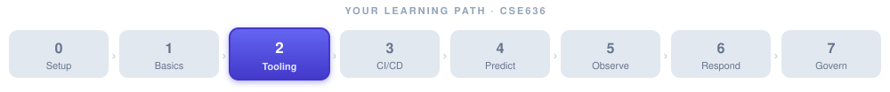

# Week 2: AI Agent Tooling, Protocols & Platforms



> 📝 **Lecture notes.** The hands-on lab and assignment for this week live in **[week-02-lab.md](week-02-lab.md)**.


**Course arc position:** Week 2 of 7 — *Tooling & Protocols*

This week you move from understanding *what* an AI agent is to understanding *which tools exist* and *how agents connect to the outside world*. [Week 1](../week-01/week-01-notes.md) established the agent anatomy (perceive → plan → act → observe), the levels of autonomy, and LLM tool-calling. Now we populate the toolbox: real coding agents, AIOps platforms with agentic features, the Model Context Protocol (MCP) that lets agents plug into DevOps systems safely, orchestration frameworks, and the permissions model that keeps agents from causing havoc.

By the end of this week you will have connected a small agent to a real tool and deployed a pipeline that calls an AI for code review — the building block of every lab that follows.

**Looking ahead:** [Week 3](../week-03/week-03-notes.md) puts agents *inside* the CI/CD pipeline — code review, test generation, and self-healing builds — so the pipeline and MCP plumbing you set up in this week's lab will carry forward directly.

> 🎯 **At a glance**
>
> | | |
> |---|---|
> | **Prerequisites** | [Week 1](../week-01/week-01-notes.md) (agent anatomy, autonomy levels, tool-calling) |
> | **Time budget** | 2 sessions: ~2 hrs + ~1.5 hrs |
> | **By the end you can** | Compare real AI coding agents & AIOps platforms; explain MCP (host/client/server) and least-privilege; choose an orchestration framework |
> | **What you'll build** | A Jenkins pipeline with an AI code-review stage + a working MCP server (see the [lab](week-02-lab.md)) |

---

## 🧱 Foundations Primer

This primer covers two base technologies you need for the lab and for the rest of the course: **Git/GitHub** and **Docker/containers**. If you have used both before, skim the summaries and move on; the Key Commands tables are worth keeping as a reference.

### Part A: Git & GitHub — Version Control from Scratch

*Source deck: [Git deck](../../slides/Git.md)*

#### Why version control exists

Imagine you are working on a Python script and it finally works. You keep improving it. Three hours later it is broken and you cannot remember what you changed. Sound familiar? That is the problem version control solves.

A **version control system (VCS)** records snapshots of your files over time so you can:

- Rewind to any earlier snapshot.
- See exactly what changed between any two snapshots.
- Work in parallel with teammates without overwriting each other.
- Keep an authoritative, backed-up copy off your laptop.

The most widely used VCS today is **Git**, created by Linus Torvalds in 2005 to manage the Linux kernel source code. Git is *distributed*, meaning every developer has a full copy of the history — not just a checkout of the latest files.

**GitHub** is a cloud hosting service for Git repositories. Think of Git as the engine and GitHub as the garage where you park your car so your whole team can access it. You do *not* need GitHub to use Git — you can use Git entirely on your own computer — but most teams use a hosting service.

#### The three-area model

Git tracks your work in three areas:

| Area | Where it lives | What it contains |
|---|---|---|
| **Working directory** | Your file system | The files you are actually editing |
| **Staging area** (index) | `.git/` folder | Changes you have *selected* to include in the next commit |
| **Local repository** | `.git/` folder | All committed snapshots (the full history) |

A **remote repository** (e.g., on GitHub) is a fourth location — the shared copy your team pushes to and pulls from.

The everyday workflow looks like this:

```
Edit file  →  git add  →  git commit  →  git push
(working)     (stage)     (snapshot)      (share)
```

#### Essential Git commands

| Command | What it does |
|---|---|
| `git init` | Create a new local repo in the current folder |
| `git clone <url>` | Download an existing repo (full history included) |
| `git status` | Show which files are modified, staged, or untracked |
| `git add <file>` | Move changes into the staging area |
| `git commit -m "message"` | Save the staged snapshot to the local repo |
| `git log --oneline` | See a compact list of past commits |
| `git diff` | Show unstaged changes |
| `git pull origin main` | Fetch and merge the latest changes from the remote |
| `git push origin main` | Upload your committed changes to the remote |
| `git branch <name>` | Create a new branch |
| `git checkout <branch>` | Switch to a branch |
| `git merge <branch>` | Merge another branch into your current branch |

#### Branches — parallel workstreams

A **branch** is an independent line of development. The default branch is usually called `main` (or `master`). When you want to add a feature without disrupting the stable main branch, you create a feature branch, work there, and then *merge* it back when it is ready.

```bash
git branch feature/add-review-step   # create the branch
git checkout feature/add-review-step # switch to it
# ... make commits ...
git checkout main
git merge feature/add-review-step    # merge back
```

This pattern — branching for every change and merging via a Pull Request on GitHub — is the foundation of the CI/CD pipelines we will build in [Week 3](../week-03/week-03-notes.md).

#### ⚠️ Common Git pitfalls

- **Forgetting `git pull` before editing.** You end up editing a stale copy and will face merge conflicts later.
- **Committing secrets.** Never commit API keys, passwords, or `.env` files. Use `.gitignore` to exclude them, and treat any secret that touched a repo as compromised.
- **Giant commits.** A single commit labeled "everything" is hard to review and impossible to revert surgically. Commit one logical change at a time with a clear message.

---

### Part B: Docker & Containers — Packaging Applications

*Source deck: [Docker 101 deck](../../slides/Docker_101.md)*

#### What is a container, and how is it different from a VM?

Before containers, the classic problem was: "It works on my machine." The test environment had different library versions, a different operating system patch, a different Python version. Containers solve this by packaging the application *and* all its dependencies together into a single portable unit.

**Virtual Machines (VMs)** virtualize the entire hardware stack. Each VM runs its own full guest operating system on top of a hypervisor. That gives strong isolation but costs memory and startup time.

**Containers** share the host operating system kernel. They isolate the application at the process level using Linux namespaces and cgroups. The result is lighter, faster to start (seconds vs. minutes), and much denser — you can run many more containers than VMs on the same hardware.

| | Virtual Machine | Container |
|---|---|---|
| Isolation | Full OS per VM | Process-level (shared kernel) |
| Start time | Minutes | Seconds |
| Size | Gigabytes | Megabytes |
| Portability | Good | Excellent |
| Use case | Strong isolation, different OS | Microservices, CI/CD workloads |

VMs and containers are not mutually exclusive — many production systems run containers *inside* VMs for an extra layer of security.

#### Docker vocabulary

- **Docker Image:** A read-only template that defines what is in a container (the OS layer, runtime, your application code). Think of it as a recipe or a class definition.
- **Docker Container:** A running instance of an image. One image can spin up many containers simultaneously. Think of a container as an object instantiated from the class.
- **Dockerfile:** A plain-text script of instructions Docker follows to build an image (which base image to use, which packages to install, which code to copy in).
- **Docker Hub / Registry:** A cloud store for images. `docker pull nginx` downloads the official Nginx image from Docker Hub.
- **Docker Engine:** The daemon that builds, runs, and manages containers on your machine.

#### The Build–Ship–Run workflow


#### Essential Docker commands

| Command | What it does |
|---|---|
| `docker build -t <name> .` | Build an image from a Dockerfile in the current directory |
| `docker images` | List locally available images |
| `docker run -d -p 8080:80 <image>` | Run a container in the background, mapping port 8080 on the host to 80 inside |
| `docker ps` | List running containers |
| `docker stop <name>` | Stop a running container |
| `docker rm <name>` | Remove a stopped container |
| `docker pull <image>` | Download an image from a registry |
| `docker push <image>` | Upload an image to a registry |
| `docker logs <name>` | View a container's stdout/stderr |
| `docker exec -it <name> bash` | Open an interactive shell inside a running container |

#### A minimal Dockerfile example

```dockerfile
# Start from an official Python base image
FROM python:3.11-slim

# Set a working directory inside the container
WORKDIR /app

# Copy and install dependencies first (better layer caching)
COPY requirements.txt .
RUN pip install --no-cache-dir -r requirements.txt

# Copy application code
COPY . .

# What command to run when the container starts
CMD ["python", "app.py"]
```

#### Why Docker matters for this course

Every lab in this course runs tools (Jenkins, MCP servers, agents) inside containers. Docker gives you a reproducible environment — the same image runs identically on your laptop, in CI, and in the cloud. The Jenkins teaching setup in [`../../project/Jenkins/`](../../project/Jenkins/) is entirely Docker-based, and this week's lab will use Docker to run both the pipeline and the MCP server.

#### ⚠️ Common Docker pitfalls

- **Running containers as root.** The default, but a security risk — especially when containers mount the host filesystem (as Jenkins-in-Docker does). Use `USER` in the Dockerfile to drop privileges.
- **Hardcoding secrets in the Dockerfile.** Any `RUN` or `ENV` instruction that contains a password is baked into the image layer and visible to anyone who pulls it. Use Docker secrets, environment variables at runtime, or a secrets manager.
- **Ignoring image size.** A 4 GB image is slow to push, pull, and scan. Use slim base images and multi-stage builds.

---

## Session 3: AI Coding Agents & Agentic Tooling

**Budget: ≈ 2 hours**

### Learning Objectives

By the end of Session 3 you will be able to:

1. Describe the core capabilities of at least five AI coding agents and distinguish their approaches.
2. Explain what an AIOps platform is and name the agentic features of the major vendors.
3. Articulate concrete criteria for deciding when *not* to use an agent.
4. Sketch a toolchain that integrates an AI coding agent into an existing development workflow.

---

### Timed Agenda

| Time | Block |
|---|---|
| 0:00 – 0:10 | Welcome back, recap of Week 1, this week's roadmap |
| 0:10 – 0:40 | AI coding agents compared (concept + live demo) |
| 0:40 – 1:05 | AIOps platforms with agentic features |
| 1:05 – 1:20 | When NOT to use an agent — the governance frame |
| 1:20 – 1:40 | Building toolchains with AI/agent plug-ins |
| 1:40 – 2:00 | 💬 Discussion & Q&A |

---

### Concept: AI Coding Agents — What They Are and How They Differ

#### The basic idea

An **AI coding agent** is a software tool that uses a large language model (LLM) to help with software development tasks — but goes beyond a chatbot. A chatbot answers a question. An agent can *act*: read files, write files, run tests, call the compiler, push a commit, open a pull request. It executes a multi-step plan autonomously, with some degree of human review at checkpoints.

Think of a coding agent as a very capable contractor you have hired to work in your codebase. You give it a task ("add unit tests for this module"), it reads the relevant code, writes the tests, runs them to verify they pass, and hands you a pull request. You review and approve — or reject and redirect.

This is exactly the **perceive → plan → act → observe** loop from [Week 1](../week-01/week-01-notes.md), applied to a software development context.

#### The competitive landscape (2025)

| Agent | Made by | How it works | Autonomy level |
|---|---|---|---|
| **Claude Code** | Anthropic | CLI tool; reads/edits files, runs shell commands, searches codebases; designed for "agentic" multi-step tasks; integrates via MCP | Human-in-the-loop by default; can be scripted for automation |
| **Cursor** | Anysphere | IDE (fork of VS Code) with AI woven into editing, autocomplete, and an "agent mode" that can edit multiple files and run commands | Human-in-the-loop; agent mode requires approval for destructive changes |
| **GitHub Copilot (agent mode)** | Microsoft/GitHub | Extension in VS Code/JetBrains; agent mode can propose multi-file changes, run tests, iterate on errors; integrated with GitHub PRs | Human-in-the-loop; proposed changes shown as diffs for review |
| **Devin** | Cognition AI | Cloud-hosted "software engineer agent"; given a task, it opens a browser, runs a terminal, writes code, browses docs, iterates | More autonomous; human monitors; still makes errors requiring correction |
| **OpenAI Codex (API)** | OpenAI | Cloud API for code generation/editing; basis for many agent wrappers; also offered as a CLI agent | Varies by wrapper; pure API is headless |

#### Claude Code — a closer look

Claude Code runs in your terminal. You point it at a repository and give it an instruction in natural language. It then:

1. **Reads** the relevant files (perceives context).
2. **Plans** the changes needed.
3. **Edits** files, runs shell commands (tests, linters, builds).
4. **Reports** what it did and shows you the diff.

You control how much autonomy it has: you can require it to ask permission before every file write, or let it run a full task and show you the result at the end.

Claude Code also supports MCP (covered in Session 4), which lets it connect to external systems — issue trackers, build tools, monitoring dashboards — as tools it can call during a task.

#### Cursor — the IDE approach

Cursor takes a different philosophy: the AI lives *inside* the editor. Tab completion suggests whole blocks of code in context; the chat panel can read your entire open file or a selection; "agent mode" can touch multiple files across the project. Because everything is in the IDE, the feedback loop is tight — you see changes inline as they are proposed.

The trade-off: Cursor's agent mode is powerful but IDE-bound. It is less suited for headless automation (e.g., running inside CI) than a CLI agent like Claude Code.

#### GitHub Copilot agent mode

GitHub Copilot started as autocomplete but has evolved into a full agent. In 2025 its agent mode can:

- Understand an issue description and propose code changes.
- Run tests and iterate if they fail.
- Open a pull request with its changes for human review.
- Operate on cloud infrastructure (GitHub Actions) rather than your local machine.

Because it lives inside GitHub's ecosystem, it integrates naturally with repositories, issues, and PR review workflows.

#### Devin — high autonomy

Devin represents a higher autonomy tier: given a software task, it operates a full development environment (browser, terminal, editor) and works toward a solution with minimal intervention. It is designed for tasks like "set up this project from scratch" or "investigate this bug and submit a fix."

The caveat — and this is important to teach students — is that higher autonomy does not mean higher reliability. Devin makes mistakes. It can go down wrong paths, loop, or produce plausible-looking but subtly wrong code. Human review remains essential.

#### ✅ Check your understanding

**Q:** A teammate says "Devin is more autonomous than Claude Code, so it's the better tool for our production refactor." What's the flaw in that reasoning?

<details><summary>💡 Show answer</summary>

It conflates **autonomy with reliability**. A higher autonomy tier just means less human checking *by default* — it does not mean the output is more correct. Devin still produces plausible-but-wrong code and can loop down bad paths. For a high-blast-radius production refactor you'd want *more* human review, which favors a human-in-the-loop workflow regardless of which tool is "more autonomous."

</details>

---

### Concept: AIOps Platforms with Agentic Features

#### What is AIOps?

**AIOps** (Artificial Intelligence for IT Operations) is the application of machine learning and AI to the *operations* side of software delivery: monitoring, alerting, incident response, capacity planning, and reliability.

The traditional approach to operations is reactive: something breaks, an alert fires, a human wakes up and investigates. AIOps tools try to make operations *proactive* — detecting anomalies before they become outages, correlating alerts from dozens of systems into one incident, and predicting capacity problems before they cause degradation.

The major platforms have recently added *agentic* features: the AI does not just surface insights, it can take action.

#### The major platforms

| Platform | Vendor | Agentic feature highlight |
|---|---|---|
| **Datadog Bits AI** | Datadog | Natural-language query of metrics/logs; AI-generated root-cause summaries; recommended remediation steps; can draft runbooks |
| **New Relic AI** | New Relic | Conversational AI over observability data; agentic workflows that can open tickets, trigger rollbacks, or page on-call based on anomaly context |
| **Dynatrace Davis** | Dynatrace | Causal AI — automatically builds a dependency map, identifies root cause of problems, and scores impact; Davis Autopilot can take automatic remediation actions within configured guardrails |
| **PagerDuty AI** | PagerDuty | Alert noise reduction and grouping; AI-generated incident summaries and postmortems; recommended responders; Copilot for incident triage |

#### Capabilities to understand

**Anomaly detection:** Instead of static thresholds ("alert if CPU > 80%"), AI platforms learn what "normal" looks like for your system and alert when the pattern deviates — catching subtle, slow-moving problems that threshold alerts miss.

**Prediction:** Some platforms forecast future resource consumption or failure probability based on historical trends, enabling *proactive* scaling or maintenance before a problem occurs.

**Root-cause analysis (RCA):** When an incident occurs, the platform automatically correlates events across services, traces, and logs to identify the likely cause — reducing the time an engineer spends manually tracing through dashboards (mean-time-to-resolution, MTTR).

**Optimization:** AI recommends (or automatically applies) configuration changes — autoscaling rules, query optimizations, deployment rollbacks — based on observed impact.

---

### Concept: When NOT to Use an Agent

This is one of the most important topics in the course. An AI agent is a tool; using it everywhere, blindly, creates risk.

#### The "when not to use" framework

| Situation | Why an agent is risky | Better approach |
|---|---|---|
| **The task is unclear or underspecified** | The agent will confidently do the wrong thing | Clarify requirements first; use the agent for a well-defined subtask |
| **Changes are irreversible** | An agent can delete data, push to production, or alter a database with no undo | Require human approval; use staging environments; add blast-radius limits |
| **Security-sensitive operations** | Agents can be prompt-injected to leak secrets or perform unintended actions | Scope permissions tightly; audit every action; never give an agent production credentials |
| **Compliance or audit trail required** | Agent actions may not produce the required documentation | Keep a human in the loop for sign-off; log every agent action |
| **Correctness is critical and not automatically verifiable** | LLMs hallucinate; code can look right but be subtly wrong | Always run tests after AI-generated code; have a human review the diff |
| **The domain is novel or highly specialized** | LLMs are trained on available internet data; if your system is unique, the agent may lack context | Provide extensive context via RAG or MCP; treat agent output as a first draft |

A useful mental checklist before deploying an agent for a new task:

1. What is the blast radius if the agent does the wrong thing?
2. Can the action be reversed?
3. Is there an automated way to verify correctness (tests, lint, type checker)?
4. What data will the agent access? Is any of it sensitive?
5. Who reviews and approves the agent's output before it reaches production?

#### ✅ Check your understanding

**Q:** A developer wants an agent to auto-delete cloud resources tagged "unused" to save money — with no human review. Run it through the checklist: which red flags fire?

<details><summary>💡 Show answer</summary>

At least three: **blast radius** (deleting the wrong resource could take down a live service), **reversibility** (deletes are often irreversible), and **verifiability** (a "unused" tag may be stale or wrong — there's no automatic test that a resource is truly safe to delete). The fix: keep a human in the loop, dry-run first, and limit the action to a reversible step (e.g. *stop* before *delete*).

</details>

---

### Concept: Building Toolchains with AI/Agent Plug-ins

An **AI toolchain** is a connected set of tools where an AI agent orchestrates work that spans multiple systems.

Example toolchain for a code change:

![A vertical toolchain orchestrated by an AI agent. A Developer request flows into an AI coding agent (Claude Code / Copilot) that reads the codebase via Git, writes and edits code, runs tests on the CI runner, checks style and security with a linter/SAST tool, and opens a pull request via the GitHub API. A human reviewer approves the PR (the approval gate), then a CI/CD pipeline deploys the change, and an AIOps platform monitors deployment health — triggering a rollback agent if an anomaly is detected, closing the loop.](ai-toolchain.svg)

The glue between these tools is increasingly **MCP** (Model Context Protocol), which we cover in Session 4. Before MCP, each agent needed a custom integration per tool. MCP standardizes that connection.

#### Plug-in ecosystems

Most AI tools now have plug-in or extension marketplaces:

- **Claude Code** connects to tools via MCP servers (see Session 4).
- **Cursor** has extensions for linters, test runners, and CI.
- **GitHub Copilot** integrates with GitHub Actions, GitHub Issues, and third-party tools through the GitHub Marketplace.
- **Datadog, New Relic, Dynatrace** expose APIs and webhooks that agent frameworks (LangGraph, AutoGen) can call as tools.

---

### Worked Example: Running Claude Code on a Sample Repository

This is a live demo you can run in class. Students will repeat a version of this in the lab.

**Setup (do before class):**

```bash
# Install Claude Code (requires an Anthropic API key)
npm install -g @anthropic-ai/claude-code
export ANTHROPIC_API_KEY=<your-key>

# Clone a simple Python web service for demo purposes
git clone https://github.com/pallets/flask.git demo-repo
cd demo-repo
```

**Demo steps:**

```bash
# Ask Claude Code to explain the project structure
claude "What is the structure of this project? Summarize the main modules."

# Ask it to find potential issues
claude "Look at the error handling in this codebase. Are there any cases where exceptions are swallowed silently?"

# Ask it to add a test (watch it read files, write code, run the test)
claude "Add a unit test for the url_for function in routing. Run it to verify it passes."
```

**What to observe:** Notice that Claude Code reads multiple files to build context before writing anything. It runs the test itself and iterates if the test fails. Every file write is shown as a diff that you can approve or reject. This is the human-in-the-loop pattern in action.

---

### 💬 Discussion & Case Questions — Session 3

1. **Choosing an agent:** Your team currently uses GitHub for source control and GitHub Actions for CI. A developer proposes adding Cursor for local coding and GitHub Copilot agent mode for automated PR review. A manager suggests also trialing Devin for "autonomous" feature work. What questions would you ask before approving each of those three additions?

2. **AIOps in practice:** A medium-sized e-commerce company is evaluating Datadog Bits AI after repeated 2 AM on-call pages for alert storms. The tool promises to correlate alerts and provide AI-generated root-cause summaries. What are the benefits? What are the risks or assumptions you would verify before relying on the AI's root-cause conclusions?

3. **When not to use:** Your company handles healthcare records (HIPAA regulated). A developer wants to use an AI coding agent to help refactor the patient data access layer. Walk through the "when not to use" checklist. What safeguards would you require before allowing this?

4. **Toolchain design:** Sketch a toolchain for a five-person startup that wants to use AI agents to accelerate their two-week sprint cycle. What tools would you connect? Where would you keep a human in the loop?

---

### 🔑 Key Terms — Session 3

| Term | Definition |
|---|---|
| **AI coding agent** | An LLM-based tool that can autonomously read/write code, run commands, and take multi-step actions in a software project |
| **AIOps** | Application of AI/ML to IT operations — monitoring, alerting, incident response, capacity planning |
| **Anomaly detection** | Identifying patterns in metrics/logs that deviate from a learned baseline, without relying solely on static thresholds |
| **Root-cause analysis (RCA)** | The process of identifying the underlying cause of an incident, as opposed to its symptoms |
| **MTTR** | Mean Time To Resolution — the average time to fix an incident; a key reliability metric |
| **Blast radius** | The scope of damage if an automated action goes wrong (e.g., how many services are affected if an agent deletes the wrong config) |
| **Toolchain** | A connected set of tools used together in a workflow; in AI DevOps, agents act as orchestrators connecting these tools |
| **Human-in-the-loop** | An autonomy level where a human must approve each significant agent action before it is executed |
| **Prompt injection** | An attack where malicious content in data the agent reads tricks it into taking unintended actions |

---

### ⚠️ Common Pitfalls — Session 3

- **Over-trusting agent output.** Agents produce plausible-sounding code. "Plausible" is not the same as "correct." Always run tests; always review diffs.
- **Giving agents too much access too soon.** Start with read-only permissions and add write access incrementally, after you understand the agent's behavior.
- **Picking a tool because it is new, not because it fits the workflow.** The best agent is the one that integrates cleanly with your existing tools and processes, not the one with the most impressive demo.
- **Ignoring latency and cost.** Every agent action calls an LLM API. In a busy CI pipeline with many concurrent builds, costs and latencies accumulate. Design with cost controls from the start.
- **No audit trail.** If an agent changes code, you need to know what it changed, when, why, and who approved it. Use commit messages, PR comments, and agent action logs.

---

## Session 4: Agent Protocols, Frameworks & Environments

**Budget: ≈ 1.5 hours**

### Learning Objectives

By the end of Session 4 you will be able to:

1. Explain what MCP is and why it was created, using the USB-C port analogy.
2. Describe the structure of an MCP server (tools, resources, prompts) and sketch a minimal example.
3. Compare at least two agent orchestration frameworks (LangGraph, CrewAI, AutoGen, Google ADK).
4. Name three cloud-hosted agent services and describe their positioning.
5. Explain the principle of least privilege as applied to agent credentials and token scopes.

---

### Timed Agenda

| Time | Block |
|---|---|
| 0:00 – 0:05 | Recap of Session 3 and bridge to protocols |
| 0:05 – 0:30 | Model Context Protocol (MCP) — concept, analogy, example |
| 0:30 – 0:55 | Agent orchestration frameworks |
| 0:55 – 1:05 | Cloud agent services overview |
| 1:05 – 1:20 | Secrets, credentials, and permissions for agents |
| 1:20 – 1:30 | Lab walkthrough preview + 💬 Discussion |

---

### Concept: The Model Context Protocol (MCP)

#### The problem it solves

Before MCP, connecting an AI agent to an external tool (a database, a CI system, a Git server) required a custom integration for each pair of agent + tool. If you wanted Claude Code to query your Jira tickets, someone had to write a Jira connector specifically for Claude Code. If you then wanted your LangChain agent to query Jira too, someone had to write another connector. Multiply this across dozens of agents and hundreds of tools and you have what engineers call an **N×M integration problem** — every new agent needs connectors to every tool, and every new tool needs connectors to every agent.

MCP solves this by defining a **standard protocol**: a shared language that any agent can use to talk to any tool that has been wrapped in an MCP server. The agent does not need to know the tool's internal API; it just speaks MCP.

#### The USB-C port analogy

Think about laptop chargers before USB-C: every laptop vendor had a proprietary connector. Buying a new laptop meant buying a new charger. USB-C created a universal standard — any USB-C cable works with any USB-C device. MCP is the USB-C port for AI agents and tools.

| USB-C | MCP |
|---|---|
| A universal connector standard | A universal protocol for agent ↔ tool communication |
| Any device with USB-C can charge from any USB-C power adapter | Any MCP-compatible agent can use any MCP server |
| You write one cable spec, not one per device pair | You write one MCP server per tool, not one per agent |

#### MCP architecture

MCP defines three parties:

- **MCP Host:** The AI agent or the application running it (e.g., Claude Code, a LangChain app). The host decides when to call tools and what to do with the results.
- **MCP Client:** A component inside the host that manages connections to one or more MCP servers. The client handles the protocol handshake, authentication, and message routing.
- **MCP Server:** A lightweight process that exposes tools and data from one system (e.g., a GitHub server, a Postgres server, a Jenkins server). It declares what it can do, and the agent calls it at runtime.


#### The three primitives MCP exposes

**1. Tools** — functions the agent can call. A tool has a name, a description, and a JSON Schema describing its input parameters. The LLM reads the description and decides when to call the tool.

Example tool definition (in JSON):

```json
{
  "name": "get_build_status",
  "description": "Returns the status of the most recent Jenkins build for a given job name.",
  "inputSchema": {
    "type": "object",
    "properties": {
      "job_name": {
        "type": "string",
        "description": "The Jenkins job name, e.g. 'backend-api'"
      }
    },
    "required": ["job_name"]
  }
}
```

When the agent is trying to answer "is the backend-api build green?" it sees this tool, forms the call `get_build_status(job_name="backend-api")`, and sends it to the Jenkins MCP server, which queries Jenkins and returns the result.

**2. Resources** — data sources the agent can read, identified by URI. A resource might be a file, a database row, a webpage, or a build log. Unlike a tool (which does something), a resource is read-only data.

**3. Prompts** — pre-defined prompt templates that the MCP server provides to help the agent use the tools correctly. Less commonly used but useful for complex domains.

#### A minimal MCP server in Python

```python
# minimal_mcp_server.py
# Requires: pip install mcp

from mcp.server import Server
from mcp.server.stdio import stdio_server
from mcp.types import Tool, TextContent
import subprocess

app = Server("demo-jenkins-server")

@app.list_tools()
async def list_tools():
    return [
        Tool(
            name="get_build_status",
            description="Returns the last build result for a Jenkins job.",
            inputSchema={
                "type": "object",
                "properties": {
                    "job_name": {"type": "string", "description": "Jenkins job name"}
                },
                "required": ["job_name"]
            }
        )
    ]

@app.call_tool()
async def call_tool(name: str, arguments: dict):
    if name == "get_build_status":
        job = arguments["job_name"]
        # In a real server, this would call the Jenkins REST API.
        # For demo, we simulate a response.
        return [TextContent(type="text", text=f"Job '{job}': LAST BUILD SUCCESS (build #42)")]

if __name__ == "__main__":
    import asyncio
    asyncio.run(stdio_server(app))
```

To connect Claude Code to this server, add an entry to your MCP configuration:

```json
{
  "mcpServers": {
    "demo-jenkins": {
      "command": "python",
      "args": ["/path/to/minimal_mcp_server.py"]
    }
  }
}
```

Now when you ask Claude Code "Is the backend-api build passing?", it automatically calls your `get_build_status` tool rather than hallucinating an answer.

#### Why MCP matters for DevOps

MCP turns an AI agent from a clever text generator into a **system actor** — it can read your actual metrics, query your real issue tracker, trigger your actual build system. This is what makes agentic DevOps *real*. But it also means the agent has real power to cause real damage, which is why permissions (covered below) matter so much.

#### ✅ Check your understanding

**Q:** Before MCP, connecting 4 agents to 6 tools could mean writing 24 custom integrations. Why does MCP turn that "N×M" problem into "N+M"?

<details><summary>💡 Show answer</summary>

With MCP you write **one MCP server per tool** (M servers) and each agent just speaks the MCP protocol (N clients) — so you build M + N pieces, not M × N. Any MCP-compatible agent can use any MCP server without a bespoke connector for that exact pair. That's the USB-C idea: one standard, not one cable per device pair.

</details>

---

### Concept: Agent Orchestration Frameworks

When a task is complex — "refactor this service, update the API docs, notify the team on Slack, and open a PR" — a single agent call may not be enough. You need multiple agents working in concert. **Orchestration frameworks** provide the tools to wire agents together into workflows, pipelines, and teams.

#### LangGraph

**LangGraph** (by LangChain) models an agent workflow as a directed graph. Each node is a function or an LLM call; edges determine which node runs next based on the output of the previous one. Edges can be conditional ("if the tests pass, go to the PR node; if they fail, go to the debug node").

LangGraph is well-suited for workflows with clear decision points, loops (retry until tests pass), and human-in-the-loop checkpoints (pause and wait for a user to approve).


#### CrewAI

**CrewAI** uses the metaphor of a *crew* — a team of specialized agents with different roles. You define agents (a "Coder" agent, a "Reviewer" agent, a "Security Auditor" agent) each with a role description, a goal, and a backstory that shapes its behavior. You then define a task list and assign tasks to agents.

CrewAI handles the coordination: agents can delegate tasks to each other, share memory, and collaborate toward a shared goal. It is good for multi-agent workflows that resemble human team dynamics.

#### AutoGen (Microsoft)

**AutoGen** (by Microsoft Research) is designed for *multi-agent conversation* — agents that communicate with each other in natural language to solve a task. You can have a "Developer" agent and a "Critic" agent debate a code change, or a "Planner" agent delegate subtasks to specialist agents.

AutoGen supports both autonomous agent-to-agent conversation and human-in-the-loop patterns where a human participant joins the conversation at key points.

#### Google ADK (Agent Development Kit)

**Google ADK** is Google's framework for building agents that run on Google Cloud infrastructure (Vertex AI). It provides: built-in tool use (Google Search, Code Execution), streaming support, evaluation tools, and deployment to Vertex AI Agent Builder. ADK agents can be composed into multi-agent hierarchies and share session state.

If your organization is heavily invested in Google Cloud, ADK integrates naturally with BigQuery, Cloud Run, and GCP monitoring — useful for the observability and capacity planning work in [Week 4](../week-04/week-04-notes.md) and [Week 5](../week-05/week-05-notes.md).

#### Framework comparison summary

| Framework | Best for | Key concept | Human-in-the-loop support |
|---|---|---|---|
| **LangGraph** | Complex workflows with loops and decisions | Directed graph of steps | First-class: pause/resume at any node |
| **CrewAI** | Team-based tasks with specialized agents | Crew of role-playing agents | Via human agent in the crew |
| **AutoGen** | Conversational multi-agent problem solving | Agent-to-agent dialogue | Human can join as a participant |
| **Google ADK** | Google Cloud-native agent deployment | Tool-using agents on Vertex AI | Via interrupt / approval patterns |

---

### Concept: Cloud Agent Services

In addition to frameworks you run yourself, major cloud providers offer *managed* agent services — you provide the task and tools, the cloud manages the infrastructure, memory, sessions, and scaling.

| Service | Provider | What it offers |
|---|---|---|
| **Amazon Bedrock Agents** | AWS | Fully managed agents on AWS; connect to knowledge bases (S3 + vector search), Lambda functions as tools, and Action Groups; integrates with AWS IAM for permissions |
| **Vertex AI Agent Builder** | Google Cloud | Build, deploy, and evaluate agents on GCP; supports RAG (grounding in Cloud Storage/BigQuery), function calling, and Google ADK; integrates with Dialogflow CX |
| **Azure AI Foundry** | Microsoft | Unified platform for building AI apps and agents; integrates with Azure OpenAI, Azure AI Search (RAG), Azure Functions (tools), and GitHub Copilot |

**When to use a managed service vs. a self-hosted framework?**

- **Managed service:** Faster to prototype; no infrastructure to manage; built-in security/compliance features of the cloud provider; best if you are already on that cloud.
- **Self-hosted framework:** More control over data residency and security; no vendor lock-in; needed if you want to run fully on-prem or use models not offered by the cloud provider.

---

### Concept: Secrets, Credentials, and Permission Management for Agents

This is arguably the most important operational concern when deploying agents. An agent with broad permissions that is prompt-injected or simply makes a mistake can cause catastrophic damage.

#### The principle of least privilege

**Least privilege** means an agent (or any process) should have access to only the resources it *needs* to do its current task, and nothing more. If an agent's job is to read build logs and report status, it should have read-only access to the CI system — not write access, not admin access, not access to your production database.

This principle is borrowed from traditional security, but it is *especially* important for AI agents because:

1. Agents can be tricked (prompt injection) into performing actions they were not intended to perform.
2. Agents can misunderstand instructions and take incorrect actions.
3. Agents may have access to sensitive data they include in API calls to the LLM vendor.

#### Practical permission management

**1. Scoped API tokens.** When you give an agent access to GitHub, create a fine-grained Personal Access Token (PAT) that can only read (or write to) specific repositories, not all repositories in the organization.

**2. Short-lived credentials.** Use tokens that expire (e.g., 1 hour) rather than long-lived credentials. In cloud environments, use IAM roles with temporary credentials (AWS STS, GCP workload identity, Azure managed identity).

**3. Separate credentials per agent.** If you have a "code review" agent and a "deployment" agent, give them separate identities. If the code review agent is compromised, it cannot deploy.

**4. Environment variables, not hardcoded values.** Never put secrets in code, Dockerfiles, or MCP configuration files that are checked into version control. Use environment variables, Docker secrets, or a secrets manager (HashiCorp Vault, AWS Secrets Manager).

```bash
# Bad — secret in code
GITHUB_TOKEN = "ghp_abc123..."

# Good — secret from environment
import os
GITHUB_TOKEN = os.environ["GITHUB_TOKEN"]
```

**5. Sandboxing.** Run agents in containers or VMs with no access to the host file system beyond what they need. Apply network policies to prevent agents from calling unexpected external endpoints.

**6. Audit logging.** Every action an agent takes should be logged with: who triggered the task, what tools were called, what inputs were passed, what outputs were received, and whether a human approved the action.

#### The human-oversight spectrum revisited

From [Week 1](../week-01/week-01-notes.md), the three positions are:

| Position | What it means in agent permissions |
|---|---|
| **Human-in-the-loop** | Agent proposes every action; human must approve before execution; minimal runtime permissions needed because actions are not autonomous |
| **Human-on-the-loop** | Agent acts autonomously but a human monitors and can intervene; agent needs runtime permissions but actions should be reversible; alerts on anomalous behavior |
| **Human-out-of-the-loop** | Fully autonomous; only appropriate for well-bounded, reversible, low-blast-radius tasks with extensive audit logging and automated rollback |

For most Week 2 and Week 3 tasks, **human-in-the-loop** is the right choice. Move autonomy levels up gradually, with evidence that the agent behaves correctly.

#### ✅ Check your understanding

**Q:** Your code-review agent is given an admin token with write access to *all* org repos "so it has what it needs." Name two least-privilege fixes.

<details><summary>💡 Show answer</summary>

Any two of: **scope the token** to only the repos it reviews (and read-only, since reviewing doesn't require write); use a **separate identity** per agent so a compromise of the reviewer can't deploy; use **short-lived credentials** that expire; pull the secret from an **environment variable / secrets manager** rather than hardcoding it. The principle: grant only what *this task* needs, nothing more — because agents can be prompt-injected or simply act wrongly.

</details>

---

### Lab Walkthrough Preview: Connecting a Minimal MCP Server

In the full lab (see the 🧪 Lab section below) you will do this yourself. Here is a conceptual walkthrough.

**Scenario:** You want Claude Code to be able to check the status of your Jenkins build before making a code change.

**Step 1:** Stand up a Jenkins container (or use the existing one from this repo's `project/Jenkins/`).

**Step 2:** Create an MCP server (like the example above) that wraps the Jenkins REST API.

**Step 3:** Register the MCP server in your Claude Code configuration (`~/.claude/claude.json` or the local `.claude/settings.json`).

**Step 4:** Ask Claude Code a question that requires build status: "Is it safe to merge a PR right now? Check the current build status."

**Step 5:** Observe the MCP tool call in Claude Code's output — it should call `get_build_status`, receive the response, and incorporate it into its answer.

**What you are demonstrating:** The agent is no longer guessing or working from stale training data — it is querying *live* infrastructure state. This is the foundation of all agentic DevOps work.

---

### 💬 Discussion & Case Questions — Session 4

1. **MCP design exercise:** You want to give an AI coding agent the ability to: (a) read GitHub issues, (b) create GitHub PRs, (c) run Jenkins builds, and (d) query Datadog metrics. Sketch the MCP server architecture. How many MCP servers would you create? How would you scope the permissions for each?

2. **Framework choice:** Your team is building an agent that: reads a Jira ticket, writes code implementing the ticket, runs the test suite, and — if tests pass — opens a PR. Which orchestration framework (LangGraph, CrewAI, AutoGen, Google ADK) would you choose and why? What would change if your company runs entirely on Google Cloud?

3. **Least privilege scenario:** An agent has write access to all repositories in your organization's GitHub, because a developer thought "it needs to write code, so it needs write access everywhere." What attack scenarios does this create? How would you redesign the permission model?

4. **Cloud vs. self-hosted:** A startup with five engineers is considering using Amazon Bedrock Agents vs. building their own LangGraph agents. What factors would drive the decision? Does the answer change at 50 engineers? At 500?

---

### 🔑 Key Terms — Session 4

| Term | Definition |
|---|---|
| **MCP (Model Context Protocol)** | An open standard (from Anthropic) that defines how AI agents connect to external tools and data sources using a common protocol |
| **MCP Server** | A lightweight process that wraps one external system and exposes it to any MCP-compatible agent via declared tools and resources |
| **MCP Tool** | A callable function exposed by an MCP server, with a name, description, and input schema; the agent decides when to call it |
| **MCP Resource** | A readable data source (file, URL, database row) exposed by an MCP server |
| **Agent orchestration framework** | Software that coordinates multiple agents or multi-step agent workflows (LangGraph, CrewAI, AutoGen, Google ADK) |
| **LangGraph** | A Python framework that models agent workflows as directed graphs with nodes (steps) and conditional edges |
| **CrewAI** | A framework that models multi-agent work as a "crew" of specialized role-playing agents |
| **AutoGen** | A Microsoft framework for multi-agent conversation where agents collaborate via natural-language dialogue |
| **Google ADK** | Google's Agent Development Kit for building and deploying agents on Vertex AI |
| **Least privilege** | The security principle that any process or agent should have access only to the resources it needs, nothing more |
| **Scoped token** | An API credential limited to specific operations or resources (e.g., a GitHub PAT that can only read one repository) |
| **Prompt injection** | An attack where malicious content in data read by the agent tricks it into executing unintended instructions |
| **Sandboxing** | Running an agent in an isolated environment (container, VM) that restricts its access to the host system and network |
| **Audit log** | A record of every action taken by an agent, including inputs, outputs, tool calls, and approvals |

---

### ⚠️ Common Pitfalls — Session 4

- **One giant MCP server for everything.** Resist the urge to wrap all your tools in one MCP server with one broad set of permissions. Break tools into separate servers scoped to different permission boundaries (read-only server, CI server, deployment server).
- **Using long-lived secrets for agents.** Rotate tokens frequently; use short-lived credentials wherever possible. A token that never expires is a persistent vulnerability.
- **No audit trail for agent tool calls.** Every tool call to an MCP server should be logged. If something goes wrong, you need to reconstruct what the agent did.
- **Trusting agent reasoning about security.** Do not rely on the LLM to "decide" whether an action is safe. Enforce safety constraints in code (rate limits, operation allow-lists, read-only modes) outside the LLM's control.
- **Skipping the human-in-the-loop for new agent deployments.** Always start with human approval for every action. Gradually move to less supervision *only* after you have evidence the agent behaves reliably.
- **Embedding credentials in MCP server configuration files that go into Git.** Use environment variables or a secrets manager. The configuration file (often checked into a repo) should contain *paths* to secrets, not the secrets themselves.

---

## Recap & Looking Ahead

### This Week's Key Takeaways

1. **The agent ecosystem is rich but fragmented.** Claude Code, Cursor, Copilot, Devin — each has distinct strengths. Tool choice should follow team workflow, not hype.

2. **MCP is the connective tissue.** The USB-C analogy is real: one MCP server per tool, any MCP-compatible agent can use it. Building MCP servers is a core DevOps-with-AI skill.

3. **Frameworks are for composition.** LangGraph, CrewAI, AutoGen, and Google ADK let you compose multi-step and multi-agent workflows. Start simple (single agent, one tool) and add complexity as you understand the behavior.

4. **Permissions are not an afterthought.** Every capability you give an agent is a capability that can be misused. Design the permission model before you design the toolchain.

5. **Human oversight is a feature, not a limitation.** Keeping a human in the loop for new agent deployments is not a sign of distrust in AI — it is how you build the evidence base to safely increase autonomy over time.

### Looking Ahead: Week 3

[Week 3](../week-03/week-03-notes.md) takes everything you built this week and puts it *inside* the CI/CD pipeline as a first-class actor. You will:

- Build an agent that runs on every pull request, reviews code, and generates tests.
- Create a self-healing pipeline that detects a failing build, proposes a fix, and opens a PR behind a human-approval gate.
- Learn about guardrails on autonomous merges — what approval gates look like in Jenkins and GitHub Actions, and how to set blast-radius limits.

The Jenkins pipeline and MCP server you built in this week's lab will be the starting point. Make sure your lab is working before Week 3.

---

## References

### Course Materials

- [v2 Syllabus](../../syllabus/CSE636_Syllabus_v2.md)
- [Git deck](../../slides/Git.md)
- [Docker 101 deck](../../slides/Docker_101.md)
- [Jenkins setup](../../project/Jenkins/)
- [Week 1](../week-01/week-01-notes.md) — Agent anatomy, levels of autonomy, LLM tool-calling
- [Week 3](../week-03/week-03-notes.md) — Agentic CI/CD Pipelines

### External References (from the v2 Syllabus)

- **Model Context Protocol specification and SDKs:** https://modelcontextprotocol.io
- **Anthropic — Claude Developer & Claude Code documentation:** https://docs.anthropic.com
- **Anthropic — "Building Effective Agents":** https://www.anthropic.com/engineering/building-effective-agents
- **Google Agent Development Kit (ADK):** https://google.github.io/adk-docs/
- **OpenAI Platform documentation:** https://platform.openai.com/docs
- **OpenTelemetry GenAI semantic conventions** (for agent observability in later weeks): https://opentelemetry.io/docs/specs/semconv/gen-ai/

### Vendor Documentation

- **Datadog Bits AI:** https://docs.datadoghq.com/bits_ai/
- **New Relic AI:** https://docs.newrelic.com/docs/new-relic-solutions/new-relic-one/core-concepts/new-relic-ai/
- **Dynatrace Davis AI:** https://docs.dynatrace.com/docs/discover-dynatrace/davis-ai
- **PagerDuty AI:** https://support.pagerduty.com/docs/aiops

### Framework Documentation

- **LangGraph:** https://langchain-ai.github.io/langgraph/
- **CrewAI:** https://docs.crewai.com/
- **AutoGen (Microsoft):** https://microsoft.github.io/autogen/
- **Amazon Bedrock Agents:** https://docs.aws.amazon.com/bedrock/latest/userguide/agents.html
- **Vertex AI Agent Builder:** https://cloud.google.com/products/agent-builder
- **Azure AI Foundry:** https://learn.microsoft.com/en-us/azure/ai-foundry/
