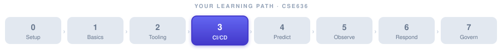

# Jenkins Agents — A DevOps Primer



> 📎 **Supplementary note for Week 3.** The main lecture notes are in **[week-03-notes.md](week-03-notes.md)** and the hands-on lab in **[week-03-lab.md](week-03-lab.md)**. This page zooms in on one concept the pipeline relies on — the **controller/agent split** — so that when the lab spins up a distributed build, you know exactly what each piece is doing.

**Theme:** A Jenkins controller is a *manager*, not a *worker*. It decides **what** should happen; **agents** decide **where** and **how** it actually runs. Understanding that division is the difference between a CI setup that scales safely and one that falls over the first time two builds run at once.

**Where this sits:** [Week 3 notes](week-03-notes.md) introduce the CI/CD pipeline and Jenkins in one page. This primer expands the "Runner / Agent" row of that anatomy table into a full mental model, and it maps directly onto the master + agent topology you run in the [lab](week-03-lab.md) (Part 1, variant B).

> 🎯 **At a glance**
>
> | | |
> |---|---|
> | **Prerequisites** | [Week 3 notes](week-03-notes.md) — pipeline, stage, step, controller vs. agent |
> | **Time budget** | ~30–40 min read |
> | **By the end you can** | Explain why agents exist, name the four agent types and when to use each, read a label-based `agent {}` block, and pick the right connection method |
> | **Ties into** | The `project/Jenkins/` master + inbound-agent setup (`Dockerfile_Agent_Inbound`, `docker-compose.agent.yml`) |

---

## 1. What problem are we solving?

A real CI/CD server is asked to do a lot, all at once:

- **Heavy work** — compiling code, building container images, running full test suites. These are CPU- and memory-hungry.
- **Diverse work** — one team needs Node.js, another needs Java 21, a third needs Terraform with cloud credentials, a fourth needs macOS to build an iOS app.
- **Parallel work** — twenty developers push commits in the same hour, and each expects their build to start *now*.

A single machine trying to do all of this runs into three walls fast: it runs out of resources, it can't hold every conflicting toolchain at once, and one runaway build can starve or crash everyone else's. Jenkins solves this by **separating the brain from the muscle**.

## 2. What is a Jenkins agent?

Jenkins splits into two roles:

- **Controller (a.k.a. master)** — the brain. It serves the web UI, schedules jobs, stores build history and credentials, and reads your `Jenkinsfile` to decide what needs to run. It should do as little *heavy lifting* as possible.
- **Agent (a.k.a. node or worker)** — the muscle. It's a machine or container that actually executes the pipeline steps: `git checkout`, `npm install`, `docker build`, `terraform apply`.

> 🧠 **The one-line principle:** *the controller decides **what**; the agent decides **where** and **how**.*


## 3. Why DevOps needs agents — four reasons

| Reason | Without agents | With agents |
|---|---|---|
| **Performance / scaling** | One box, vertical scaling only — buy a bigger server | Add more agents (horizontal scaling); builds run in parallel |
| **Isolation & safety** | Untrusted PR code runs next to your credentials | Each build runs in a throwaway, sandboxed workspace |
| **Multiple environments** | One OS/arch — can't build Windows *and* iOS | Linux, Windows, macOS, ARM, x86 agents side by side |
| **Security & compliance** | The one box has every credential for everything | Each agent gets *only* the minimal permissions its jobs need |

The security point is the one most people underweight. If your controller holds your production cloud keys **and** runs arbitrary code from every pull request, a single malicious PR can exfiltrate those keys. Agents let you keep secrets off the machine that runs untrusted code.

## 4. The four types of agent

There is a clear historical trend here: from **permanent, stateful** machines toward **ephemeral, per-job** environments that exist only for the duration of one build and are then destroyed.

![Four kinds of Jenkins agent arranged on a permanent-to-ephemeral spectrum. 1: Static VM — a long-running server that connects over SSH, whose state can drift; lifecycle: always running. 2: Docker — a container per job, clean each build, destroyed after use; lifecycle: per-job. 3: Cloud VM — EC2/GCE/Azure instances that auto-scale on demand; lifecycle: auto-scaled. 4: Kubernetes — a pod per job, fully ephemeral, scales to zero; lifecycle: per-job pod. An arrow runs from always-on and heavy on the left to ephemeral and modern on the right.](images/agent-types.svg)

1. **Static / permanent agents** — a long-running VM or physical box registered once and always available. Simple, but state drifts over time ("works on agent-3 but not agent-4") and the machine sits idle between builds.
2. **Docker agents** — a fresh container is created for each job and destroyed afterward. Every build starts from a known-clean image. This is the sweet spot for most teams and the model this repo's lab uses.
3. **Cloud VM agents** — Jenkins provisions cloud instances (EC2, GCE, Azure VMs) on demand and tears them down when idle. Good for spiky, expensive workloads where you want to pay only for what you use.
4. **Kubernetes agents** — each job runs in a throwaway **pod**. Fully ephemeral, scales to zero when nothing is building, and is the de-facto modern standard for cloud-native shops.

## 5. How Jenkins chooses an agent — labels

You almost never want to say "run on *this specific machine*." You want to say "run on *any machine that can do X*." Jenkins does this with **labels**: each agent is tagged with capability labels (`linux`, `docker`, `terraform`, `mac`, `python-agent`), and the pipeline requests a label rather than a hostname.


```groovy
pipeline {
  agent { label 'docker' }        // run on ANY agent tagged "docker"
  stages {
    stage('Build') {
      steps {
        sh 'docker build -t app .'
      }
    }
  }
}
```

Because selection is by capability, you can add, remove, or replace the underlying machines freely — as long as *something* still carries the `docker` label, the pipeline keeps working. This is what makes an agent fleet elastic.

## 6. How agents connect to the controller

Who initiates the connection matters enormously for firewalls and security. There are three common methods:

![Three ways an agent connects to the controller. Top row — WebSocket: the inbound agent, sitting behind a firewall, dials OUT to the controller's public URL; marked recommended because it is firewall-friendly and needs no open ports. Middle row — SSH: the controller dials IN to a static VM running sshd on port 22; traditional, but needs a reachable agent and an open port 22. Bottom row — Kubernetes: the controller's k8s plugin launches an ephemeral pod per job and the pod registers back; cloud-native, scales to zero. Caption: this repo's lab uses the WebSocket inbound agent.](images/agent-connection.svg)

- **WebSocket (inbound) — recommended.** The agent dials *out* to the controller over HTTP(S)/WebSocket. Nothing needs to open an inbound port on the agent, so it works cleanly behind firewalls and NAT. This is what `project/Jenkins/` uses.
- **SSH.** The controller dials *in* to the agent over SSH. Traditional for static VMs, but the agent must be network-reachable with port 22 open.
- **Kubernetes plugin.** The controller asks the cluster to launch a pod, and the pod connects back. Fully ephemeral, no standing agents.

## 7. Agent lifecycle — the ephemeral trend

| Agent type | Lifecycle | Cleaned between builds? |
|---|---|---|
| Static VM | Always running | ❌ state persists (can drift) |
| Docker agent | Created per job, destroyed after | ✅ fresh container each time |
| Cloud VM | Auto-scaled up/down | ⚠️ depends on config |
| Kubernetes pod | Created per job, destroyed after | ✅ fresh pod each time |

The direction of travel is unmistakable: **prefer ephemeral, per-job agents.** A build that starts from a clean, immutable image is reproducible; a build that runs on a machine three months of previous builds have mutated is a mystery waiting to happen.

## 8. Best practices

- **Never run builds on the controller.** Set the controller's executor count to **0**. The controller schedules; it does not compile.
- **Use labels for capabilities, not machine names.** `label 'docker'`, not `node 'build-server-07'`.
- **Prefer ephemeral agents** (Docker / Kubernetes) so every build is reproducible.
- **Separate agents by trust level.** Keep production-deploy credentials off any agent that runs untrusted PR code.
- **Grant minimal permissions per agent.** The Terraform agent gets cloud creds; the unit-test agent gets none.
- **Monitor agent health** — an offline agent silently queues jobs forever.

## 9. Common mistakes (interview traps)

- ❌ **Running everything on the master.** Works for a demo, collapses under real load, and puts your credentials next to untrusted code.
- ❌ **Treating agents as optional.** At any real scale they are mandatory, not a nice-to-have.
- ❌ **Using a single agent.** No parallelism, no isolation, no environment diversity — you've just moved the single point of failure.
- ❌ **Letting the controller run Docker builds.** Heavy, and a security hole.

## 10. How this maps onto the repo's lab

The [`project/Jenkins/`](../../project/Jenkins/) setup is a working, minimal version of everything above:

- **`Dockerfile_Master`** builds the controller image (`cstu-jenkins`).
- **`Dockerfile_Agent_Inbound`** builds an inbound **WebSocket agent** image (`cstu-jenkins-agent`) with a Python venv (`flake8 pytest anthropic mcp requests`) pre-installed.
- **`docker-compose.agent.yml`** runs the **master + agent** topology on a shared `jenkins` network.
- The agent registers once in the UI to get its JNLP secret (passed via a `.env` file) and connects over WebSocket (`JENKINS_WEB_SOCKET=true`) — the top row of the connection diagram above.
- Pipelines target it with **`agent { label 'python-agent' }`** — the label mechanism from §5.

So when you run the Week 3 lab's distributed-build variant, you are exercising: a Docker-style ephemeral-ish agent (§4), selected by label (§5), connecting over WebSocket (§6). Same concepts, running on your laptop.

---

## Check your understanding

<details><summary>💡 Why is it a security problem to run untrusted pull-request code on the controller?</summary>

The controller holds **credentials** — deploy keys, cloud tokens, signing secrets. If it also executes arbitrary code from any incoming PR, a malicious contributor can write a "test" that reads those secrets and exfiltrates them. Agents fix this by running untrusted code on a machine that has *no* production credentials, keeping the brain (and its secrets) separate from the muscle.

</details>

<details><summary>💡 Your pipeline says <code>agent { label 'docker' }</code> but the job never starts — it just sits queued. What's the most likely cause?</summary>

No online agent currently carries the `docker` label. Jenkins won't invent one — it waits (potentially forever) for a matching agent to appear. Either no agent is tagged `docker`, or the agent that is tagged is offline/disconnected. Check the node list: the fix is to bring a `docker`-labelled agent online, not to change the pipeline.

</details>

<details><summary>💡 Why is the WebSocket (inbound) connection method usually preferred over SSH?</summary>

With WebSocket the **agent dials out** to the controller, so no inbound port needs to be opened on the agent — it works behind firewalls and NAT with zero network holes. SSH requires the **controller to dial in**, meaning the agent must be publicly reachable with port 22 open, which is both more fragile and a larger attack surface.

</details>

<details><summary>💡 A teammate says "let's just make our one build server bigger instead of adding agents." What's the DevOps counter-argument?</summary>

That's **vertical** scaling, and it hits three ceilings agents don't: (1) you eventually can't buy a bigger box, and parallel builds still contend for it; (2) one machine can't hold conflicting toolchains or multiple OSes at once; (3) it keeps untrusted code and credentials on the same host. **Horizontal** scaling with agents adds capacity, isolation, and environment diversity in one move.

</details>

---

## Recap

- Jenkins separates the **controller** (schedules, stores credentials, decides *what*) from **agents** (execute steps, decide *where/how*). Keep the controller's executor count at 0.
- Agents exist for **scaling, isolation, environment diversity, and security** — especially keeping secrets off machines that run untrusted code.
- Four types, trending from permanent to ephemeral: **static VM → Docker → cloud VM → Kubernetes pod**. Prefer ephemeral, per-job agents.
- Jobs pick agents by **label** (a capability), never by hostname.
- Agents connect via **WebSocket (recommended), SSH, or the Kubernetes plugin** — who dials whom decides your firewall story.
- This repo's [`project/Jenkins/`](../../project/Jenkins/) master + inbound-agent setup is a hands-on instance of all of the above.

---

## References

### Course materials

- [Week 3 lecture notes](week-03-notes.md) — CI/CD pipeline anatomy, Jenkins in one page
- [Week 3 lab](week-03-lab.md) — Part 1 variant B builds the master + agent topology
- [Jenkins project (runnable)](../../project/Jenkins/) — `Dockerfile_Master`, `Dockerfile_Agent_Inbound`, `docker-compose.agent.yml`
- [Jenkins slide deck](../../slides/Jenkins.md) — pipeline and node concepts

### External references

- **Jenkins — Managing nodes (agents):** https://www.jenkins.io/doc/book/managing/nodes/
- **Jenkins — Distributed builds architecture:** https://www.jenkins.io/doc/book/scaling/
- **Jenkins — `agent` directive & labels (Pipeline syntax):** https://www.jenkins.io/doc/book/pipeline/syntax/#agent
- **Jenkins Kubernetes plugin:** https://plugins.jenkins.io/kubernetes/
- **Adapted from:** *Jenkins Agents — Full DevOps Lecture*, dev.to/jumptotech — https://dev.to/jumptotech/jenkins-agents-full-devops-lecture-2437 (diagrams here are original SVGs recreating the article's demonstrations in the course style)
