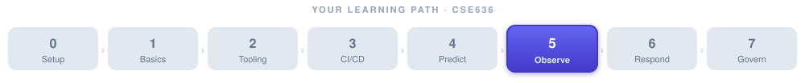

# Week 5: Intelligent Monitoring, Observability & Agent Telemetry



> 📝 **Lecture notes.** The hands-on lab and assignment for this week live in **[week-05-lab.md](week-05-lab.md)**.


**Theme:** See everything — including the AI agents themselves.

**Arc placement:** Week 5 sits at the heart of the course. You have now built pipelines (Weeks 1–3) and taught the system to *predict* the future (Week 4). This week you give the system *eyes*: the ability to watch what is happening right now, detect when something looks wrong, pinpoint the root cause, and — critically — observe the AI agents that are doing all the watching. [Week 6](../week-06/week-06-notes.md) will take the next step and let agents *act* on what they see.

**Builds on:** [Week 4](../week-04/week-04-notes.md) (time-series data, forecasting, Kubernetes autoscaling) and the agent fundamentals introduced in Weeks 1–2.

> 🎯 **At a glance**
>
> | | |
> |---|---|
> | **Prerequisites** | [Week 4](../week-04/week-04-notes.md) + the agent loop from [Week 1](../week-01/week-01-notes.md) |
> | **Time budget** | 2 sessions: ~2 hrs + ~1.5 hrs |
> | **By the end you can** | Explain the three pillars; run unsupervised anomaly detection; build an agentic RCA pipeline; and **observe the agents themselves** with OTel GenAI conventions |
> | **What you'll build** | An isolation-forest detector scored against ground truth + an OTel-instrumented agent — runnable starter in [`project/anomaly/`](../../project/anomaly/) (see the [lab](week-05-lab.md)) |

---

## 🧱 Foundations Primer

> **Read this section even if you think you already know monitoring.** The vocabulary matters for everything that follows.

### The Difference Between Monitoring and Observability

Imagine your car dashboard. The speedometer tells you how fast you are going right now — that is **monitoring**: watching known, pre-chosen metrics. But when your engine light turns on and you have no idea *why*, you need to look deeper — check the oil, read the fault codes, examine individual sensors. That deeper capability — being able to ask arbitrary questions about the system's internal state — is **observability**.

In software:

| | Monitoring | Observability |
|---|---|---|
| **Question** | "Is the system healthy?" | "Why is the system behaving this way?" |
| **What you need** | Dashboards, thresholds, alerts | Rich, queryable data from inside the system |
| **Reactive to** | Known failure modes | Unknown / unexpected failure modes |
| **Key tools** | Prometheus + Grafana, CloudWatch | OpenTelemetry, distributed tracing, structured logging |

Observability doesn't replace monitoring — it enhances it. You still want dashboards and alerts. But you also instrument the system so you can drill into any strange behaviour.

### The Three Pillars of Observability

The field has converged on three types of telemetry data, often called the "three pillars":

#### 1. Logs — The Diary

A **log** is a timestamped record of something that happened. Think of it as the diary your application writes while it runs.

```
2025-10-01T14:22:01Z  INFO  order-service  Order 12345 created for user 987
2025-10-01T14:22:03Z  ERROR order-service  Payment gateway timeout after 5000ms
```

Logs are excellent for forensic debugging ("what exactly happened right before the crash?") but hard to aggregate across thousands of service instances unless you structure them (use JSON, consistent field names) and ship them to a central store like **Elasticsearch** or **Splunk**.

#### 2. Metrics — The Vital Signs

A **metric** is a numeric measurement collected at regular intervals over time. Blood pressure, heart rate — these are metrics. In software:

- `http_request_duration_seconds` (a histogram — shows the spread of response times)
- `node_cpu_utilization` (a gauge — a value that goes up and down)
- `checkout_errors_total` (a counter — only goes up)

Metrics are cheap to store and fast to query. **Prometheus** scrapes metrics from your services and stores them as time series. **Grafana** draws dashboards from that data.

An **SLO (Service Level Objective)** is a target you set on a metric: "99.9% of requests should complete in under 200 ms." If the SLO is breached, an **alert** fires — a notification that something needs attention.

#### 3. Traces — The Journey Map

When a user clicks "checkout," that request travels through many services: frontend → order service → inventory service → payment service → email service. A **trace** follows that single request all the way through every hop.

Each step in the trace is called a **span**. Spans record start time, duration, and attributes (e.g., which database query ran, what the status code was). The spans form a tree that lets you see exactly *where* time was spent and where errors occurred.

**OpenTelemetry (OTel)** is the open-source standard for creating and exporting traces (and metrics and logs) in a vendor-neutral way. You instrument your code once with OTel; the data can go to Jaeger, Zipkin, Datadog, Honeycomb, or any other backend.

#### How the Three Pillars Work Together

Think of a detective story:
- A **metric** alert fires: "error rate on checkout just jumped to 5%."
- You look at **logs** to find the specific error messages around that time.
- You pull a **trace** for one of the failing requests to see exactly which service call failed and how long it took.

Each pillar answers a different question. Together they give you full observability.

![The three pillars of observability side by side. Metrics ("the vital signs"): numbers over time like CPU, error rate, p99 — cheap and fast — answer "Is it healthy?". Logs ("the diary"): timestamped events and error messages — forensic detail — answer "What exactly happened?". Traces ("the journey map"): one request across all hops, spans plus timing — answer "Where did it fail?". Used together as a detective story: a metric alert ("errors hit 5%") leads you to read logs (find the error text) and then pull a trace (see which call failed and how slow). OpenTelemetry instruments all three, vendor-neutral.](images/three-pillars.svg)

#### ✅ Check your understanding

**Q:** A metric alert tells you "checkout error rate jumped to 5%." Which pillar do you reach for to learn *exactly what* failed, and which to learn *where in the request path* it failed?

<details><summary>💡 Show answer</summary>

**Logs** tell you *what* — the specific error messages/stack traces around that moment. **Traces** tell you *where* — following one failing request across services to the exact span that errored or got slow. The **metric** was just the smoke alarm that started the investigation; logs and traces find the fire.

</details>

### Unsupervised Learning — Intuition for Non-ML Students

Later in Session 9 we will use unsupervised machine learning for anomaly detection. Here is the intuition you need — no math required.

**What is "unsupervised"?** In *supervised* learning you have labelled examples ("this is a normal log line," "this is an anomaly"). Labelled anomalies are rare and expensive to produce. *Unsupervised* learning finds patterns in data **without labels** — the algorithm figures out what "normal" looks like on its own.

Two techniques we will use:

**Clustering (e.g., k-means, DBSCAN)**
Imagine scattering grains of rice on a table. Your eye naturally groups them into clumps. Clustering algorithms do the same with data points. Once the clusters are found, any point that doesn't fit well into any cluster is labelled an **outlier** — a candidate anomaly. Picture your metrics data: most days look similar (tight clusters). A sudden spike sits far from all clusters.

**Isolation Forest**
Think of a game: to "isolate" a data point you keep drawing random lines through the data, splitting it, until the point is alone. Normal points are surrounded by neighbours — it takes many cuts to isolate them. Anomalies are unusual — they get isolated quickly with just a few cuts. The algorithm counts the cuts needed; few cuts → high anomaly score.

Neither technique needs you to know in advance what an anomaly looks like. That is the key advantage for ops data, where novel failures are by definition things you have not seen before.

#### ✅ Check your understanding

**Q:** Why use *unsupervised* anomaly detection for production incidents instead of training a *supervised* classifier on "normal vs. anomalous" examples?

<details><summary>💡 Show answer</summary>

Because **labelled anomalies are rare and, by definition, novel** — the next outage often looks unlike anything you've seen, so you can't have labelled it in advance. Unsupervised methods (isolation forest, DBSCAN) learn what "normal" looks like from unlabelled data and flag whatever deviates, with no need to enumerate failure types ahead of time. Supervised models are great when you *do* have abundant labels (e.g. spam), but ops failures rarely give you that.

</details>

---

## Session 9: AI-Driven Anomaly Detection

**Budget:** ~2 hours

### Learning Objectives

By the end of Session 9, students will be able to:

1. Explain the three pillars of observability and how anomaly detection applies to each.
2. Distinguish between supervised and unsupervised anomaly detection and explain when to use each.
3. Describe isolation forests and clustering at an intuitive level and apply them to a log/metric dataset.
4. Contrast real-time (streaming) and batch anomaly detection and identify appropriate use cases.
5. Describe the noise and false-positive problem and apply at least two mitigation strategies.
6. Explain why AI agents themselves must be observed and what OpenTelemetry GenAI semantic conventions provide.

### Timed Agenda

| Time | Block | Notes |
|---|---|---|
| 0:00–0:15 | Week recap & warm-up question | "Name one time you were surprised by a system failure you should have seen coming." |
| 0:15–0:40 | Concept deep dive: anomaly detection on logs, metrics, traces | Slides + whiteboard |
| 0:40–1:00 | Concept deep dive: isolation forest + clustering | Notebook demo |
| 1:00–1:15 | Real-time vs. batch; noise & false positives | Discussion |
| 1:15–1:40 | Concept: observing AI agents / OTel GenAI conventions | Demo: instrumented agent |
| 1:40–2:00 | Discussion questions + Q&A | |

---

### Concept 1: Using ML on Logs, Metrics, and Traces for Anomalies

**What does an anomaly look like?**

An anomaly is a data point or pattern that deviates significantly from what the system has learned to consider "normal." In operations data this can be:

- A sudden spike in HTTP 500 error rates.
- An unusually long tail on database query latency.
- A log message template that has never appeared before.
- A trace where a service call takes 10× its usual time.

**Why not just use thresholds?** Traditional monitoring uses hard-coded thresholds: "alert if CPU > 80%." Thresholds have two problems. First, they require a human to decide the number in advance, and the right number differs by service, time of day, and season. Second, they miss *relative* anomalies: CPU at 75% is fine normally but alarming if it usually idles at 5%.

ML-based anomaly detection learns the baseline from the data itself and flags deviations from *that learned baseline*, not from a hand-crafted number.

**Applying ML to each pillar:**

| Pillar | What you feed the model | What the model detects |
|---|---|---|
| **Metrics** | Time series of numeric values | Spikes, dips, trend changes, seasonal deviations |
| **Logs** | Parsed log templates or embeddings of log messages | Rare templates, unusual error bursts, new log patterns |
| **Traces** | Span duration vectors, dependency graphs | Slow service calls, unusual call paths, missing spans |

**Log anomaly detection in practice:**

Raw log lines are text. Before feeding them to a model you need to:

1. **Parse** the log into structured fields (timestamp, level, service, message).
2. **Drain** the message to a template (replace variable parts like IDs with wildcards) — the [Drain3 algorithm](https://github.com/logpai/Drain3) is commonly used.
3. **Vectorize** the template (e.g., count per template per window, or use an embedding model).
4. **Score** the vectorized windows with your anomaly model.

---

### Concept 2: Unsupervised Approaches — Clustering and Isolation Forests

#### Isolation Forest in Code

```python
from sklearn.ensemble import IsolationForest
import pandas as pd

# Load sample metrics: columns = [timestamp, cpu_pct, mem_pct, req_per_sec, error_rate]
df = pd.read_csv("metrics_sample.csv", parse_dates=["timestamp"])
features = df[["cpu_pct", "mem_pct", "req_per_sec", "error_rate"]]

# contamination = expected fraction of anomalies (tune based on domain knowledge)
model = IsolationForest(n_estimators=100, contamination=0.02, random_state=42)
model.fit(features)

df["anomaly_score"] = model.decision_function(features)  # lower = more anomalous
df["is_anomaly"] = model.predict(features)               # -1 = anomaly, 1 = normal

anomalies = df[df["is_anomaly"] == -1]
print(f"Detected {len(anomalies)} anomalies")
print(anomalies[["timestamp", "cpu_pct", "error_rate", "anomaly_score"]].head())
```

Key parameters to tune:
- `contamination`: your best guess at what fraction of the data is anomalous. Start at 0.01–0.05.
- `n_estimators`: number of isolation trees. 100–200 is usually enough.

#### Clustering with DBSCAN

DBSCAN (Density-Based Spatial Clustering of Applications with Noise) is useful when anomalies appear as isolated points while normal data forms dense clusters:

```python
from sklearn.preprocessing import StandardScaler
from sklearn.cluster import DBSCAN

scaler = StandardScaler()
X_scaled = scaler.fit_transform(features)

# eps = radius of neighborhood; min_samples = points needed to form a cluster core
db = DBSCAN(eps=0.5, min_samples=10)
labels = db.fit_predict(X_scaled)

df["cluster"] = labels
# DBSCAN labels outliers as -1
outliers = df[df["cluster"] == -1]
print(f"DBSCAN found {len(outliers)} outliers")
```

#### LLM-Based Log Anomaly Detection

For unstructured or highly varied log content, large language models can be surprisingly effective. The idea: ask an LLM to read a window of log lines and identify anything that looks unusual.

```python
import anthropic

client = anthropic.Anthropic()

def detect_log_anomalies(log_window: str) -> str:
    message = client.messages.create(
        model="claude-opus-4-5",
        max_tokens=512,
        messages=[{
            "role": "user",
            "content": (
                "You are an SRE reviewing application logs. "
                "Identify any lines that suggest an error, unusual behaviour, "
                "or security concern. For each finding, state the line number "
                "and a brief explanation. If nothing is unusual, say 'No anomalies found.'\n\n"
                f"LOG WINDOW:\n{log_window}"
            )
        }]
    )
    return message.content[0].text

with open("recent_logs.txt") as f:
    window = f.read()

print(detect_log_anomalies(window))
```

**When to use an LLM vs. a statistical model:**
- LLMs excel at understanding *semantic* anomalies in natural-language logs ("authentication failed for admin from unusual IP at 3 AM on a Sunday") where context matters.
- Statistical models (isolation forest, DBSCAN) are faster, cheaper, and work well on numeric time-series data.
- In practice, combine both: use a fast statistical model for continuous streaming detection, reserve LLM analysis for the top-N flagged windows.

---

### Concept 3: Real-Time vs. Batch Detection; Noise and False Positives

#### Real-Time (Streaming) Detection

In streaming detection, new data points are scored as they arrive — within seconds of being generated. This is essential for:
- Catching a cascade failure before it affects all users.
- Triggering automated remediation (the topic of Week 6).
- Meeting SLOs that require sub-minute response to incidents.

Popular streaming platforms: Apache Kafka + Flink, AWS Kinesis + Lambda, GCP Dataflow.

The challenge: you have very little context per decision. One metric value in isolation often looks fine; the anomaly only appears when you consider the last 5 minutes together. Sliding window aggregations solve this.

#### Batch Detection

Batch detection runs periodically (e.g., every 15 minutes, hourly, nightly). It has more context and can use heavier models. It is appropriate for:
- Detecting slow-moving trends (gradual memory leak, creeping latency degradation).
- Correlating anomalies across multiple services to find root causes.
- Training or retraining the anomaly model itself.

#### The Noise and False Positive Problem

In a large system with hundreds of services, even a 1% false positive rate generates dozens of spurious alerts per day. Alert fatigue — engineers learning to ignore the noise — is one of the biggest threats to operational reliability.

**Mitigation strategies:**

| Strategy | How it works |
|---|---|
| **Dynamic baselines** | Let the model adjust its expected "normal" as the system changes (e.g., after a deployment) |
| **Minimum duration** | Only fire an alert if the anomaly persists for N consecutive minutes |
| **Alert grouping / deduplication** | Merge alerts from related services into a single incident (covered more in Session 10) |
| **Feedback loops** | Let on-call engineers mark alerts as false positives; retrain the model on that feedback |
| **Seasonality-aware models** | Acknowledge that traffic at 3 AM looks different from traffic at noon; model each hour separately |
| **Confidence thresholds** | Only surface anomalies where the model's confidence score exceeds a high bar |

---

### Concept 4: Integrating Anomaly Detection in Pipelines

Anomaly detection should be a first-class citizen in your CI/CD and observability pipeline, not an afterthought bolted on later.

**Architecture pattern:**

![Anomaly detection wired into the observability pipeline. App/Infra emits telemetry to an OpenTelemetry Collector, which fans out to three backends: Metrics (Prometheus), Traces (Jaeger/Tempo), and Logs (Elasticsearch). The metrics backend feeds an Anomaly Detection service (isolation forest / ML microservice), which feeds an Alert Manager that pages PagerDuty/Slack. Best practice: separate detection from response — the detector only scores and publishes events; remediation lives in a separate agent (Week 6) — and start with the four golden signals.](images/anomaly-pipeline.svg)

**Best practices:**

1. **Start with golden signals.** Google SRE defined four: Latency, Traffic, Errors, Saturation. Get these instrumented and anomaly-detected before anything else.
2. **Version your anomaly models.** When you deploy a new version of the model, track which version generated each alert so you can audit and compare.
3. **Separate detection from response.** The detection service should only score data and publish events. Remediation logic lives in a separate agent (Week 6).
4. **Test your alerting pipeline.** Regularly fire synthetic anomalies to confirm the full pipeline (detect → alert → notify) works end-to-end.

---

### Concept 5: Observability for AI Agents — Why We Must Watch the Agents

#### The New Blind Spot

You now have excellent observability for your application services. But in a course about agentic DevOps, there is a new class of "service" running in your infrastructure: **AI agents**. These agents:

- Call LLM APIs (which cost money per token and have latency)
- Use tools (which may fail silently or produce unexpected output)
- Make decisions autonomously (which may be wrong in ways that are hard to detect from application metrics alone)

Without special instrumentation, an AI agent is a **black box** inside your observable system. You can see that it took an action (perhaps a Kubernetes restart that it triggered), but you cannot see *why* it made that decision, how many tokens it spent reasoning about it, or which tool call returned a confusing result.

This is not a hypothetical concern. In production systems:
- A misconfigured agent can spend thousands of dollars in API calls in minutes.
- An agent with a latency issue can become the bottleneck in an otherwise fast pipeline.
- An agent that silently hallucinates tool call parameters can cause incorrect remediations.

**The principle: treat your agents as first-class services with their own telemetry.**

#### OpenTelemetry GenAI Semantic Conventions

The OpenTelemetry project defines **semantic conventions** — standardized names for span attributes and metric names — so that telemetry from different libraries and vendors can be understood by the same dashboards and alert rules.

The **GenAI (Generative AI) semantic conventions** define how to record telemetry from LLM calls and AI agent actions. Key attributes (as of the current specification):

**Span attributes for an LLM call:**

| Attribute | Type | Meaning |
|---|---|---|
| `gen_ai.system` | string | LLM provider, e.g. `anthropic`, `openai` |
| `gen_ai.request.model` | string | Model name requested, e.g. `claude-opus-4-5` |
| `gen_ai.response.model` | string | Model actually used (may differ if routing) |
| `gen_ai.request.max_tokens` | int | Token limit sent in request |
| `gen_ai.usage.input_tokens` | int | Tokens consumed by the prompt |
| `gen_ai.usage.output_tokens` | int | Tokens in the completion |
| `gen_ai.operation.name` | string | Type of operation: `chat`, `embeddings`, `tool_call` |

**What you can compute from these attributes:**
- **Cost per agent action** = input tokens × $/input_token + output tokens × $/output_token
- **Latency per LLM call** = span duration
- **Tool call success rate** = count of tool-use spans with error vs. without
- **Context window efficiency** = output_tokens / input_tokens (low ratio may mean prompts are too long)

#### Instrumenting an Agent with OTel GenAI Conventions

```python
from opentelemetry import trace
from opentelemetry.sdk.trace import TracerProvider
from opentelemetry.sdk.trace.export import ConsoleSpanExporter, SimpleSpanProcessor
import anthropic
import time

# Set up a simple OTel tracer (in production, export to Jaeger/OTLP)
provider = TracerProvider()
provider.add_span_processor(SimpleSpanProcessor(ConsoleSpanExporter()))
trace.set_tracer_provider(provider)
tracer = trace.get_tracer("sre-agent")

client = anthropic.Anthropic()

def call_llm_with_telemetry(prompt: str, model: str = "claude-opus-4-5") -> str:
    """Call the LLM and emit OTel spans following GenAI semantic conventions."""
    with tracer.start_as_current_span("gen_ai.chat") as span:
        span.set_attribute("gen_ai.system", "anthropic")
        span.set_attribute("gen_ai.operation.name", "chat")
        span.set_attribute("gen_ai.request.model", model)

        start = time.time()
        response = client.messages.create(
            model=model,
            max_tokens=1024,
            messages=[{"role": "user", "content": prompt}]
        )
        latency_ms = (time.time() - start) * 1000

        # Record usage from the response
        span.set_attribute("gen_ai.usage.input_tokens",
                           response.usage.input_tokens)
        span.set_attribute("gen_ai.usage.output_tokens",
                           response.usage.output_tokens)
        span.set_attribute("gen_ai.response.model",
                           response.model)
        span.set_attribute("llm.latency_ms", latency_ms)

        return response.content[0].text


def run_sre_agent_step(context: str) -> str:
    """An agent step that investigates a system context and returns an action."""
    with tracer.start_as_current_span("sre_agent.investigate") as agent_span:
        agent_span.set_attribute("agent.step", "investigate")
        agent_span.set_attribute("context.length_chars", len(context))

        prompt = (
            "You are an SRE agent. Given the following system context, "
            "identify the most likely root cause and suggest one remediation action.\n\n"
            f"CONTEXT:\n{context}"
        )
        result = call_llm_with_telemetry(prompt)
        agent_span.set_attribute("agent.recommendation", result[:200])  # truncate for span
        return result


# Example usage
context = """
ERROR RATE on checkout-service: 4.2% (baseline: 0.1%)
LATENCY p99 on payment-service: 8500ms (baseline: 200ms)
Recent deployment: payment-service v2.3.1 deployed 12 minutes ago
"""
recommendation = run_sre_agent_step(context)
print(recommendation)
```

**What this gives you in your trace backend:**
- A parent span `sre_agent.investigate` showing total agent step time and the truncated recommendation.
- A child span `gen_ai.chat` with exact token counts, latency, and model used.
- Cost can be computed post-hoc by joining token counts with the provider's pricing table.

**Important: never log the full prompt or completion in production if it may contain PII or secrets.** Use truncated strings or hashed representations for sensitive content.

#### ✅ Check your understanding

**Q:** Your application dashboards all look green, yet your cloud bill spiked overnight because an agent burned thousands of dollars in LLM calls. Why didn't normal observability catch it, and what specifically would?

<details><summary>💡 Show answer</summary>

Standard app metrics don't see *inside* the agent — it's a **black box** that happens to call an LLM API. You need to treat the agent as a first-class service and emit **OTel GenAI telemetry**: `gen_ai.usage.input_tokens` / `output_tokens` per call (→ cost), span duration (→ latency), and tool-call success spans. With those you can alert on token-spend or call-rate in real time instead of discovering it on the monthly invoice.

</details>

---

### 💬 Discussion & Case Questions — Session 9

1. **Threshold vs. ML alerts:** Your team currently has 200 threshold-based alerts. The on-call engineer acknowledges 80% of them without investigating ("alert fatigue"). What would you change, and how would you use ML-based detection to reduce noise without missing real incidents?

2. **Cost surprise:** An AI agent running anomaly detection spent $3,000 in LLM API costs overnight — nobody noticed until the monthly invoice. What observability and guardrails would you have put in place to catch this in real time?

3. **Vendor lock-in:** Your company uses Datadog for metrics and Splunk for logs. A colleague proposes ripping out both and replacing them with an open-source OTel-native stack. What are the trade-offs?

4. **Model drift:** You deployed an isolation forest anomaly detector trained on last month's traffic patterns. Two weeks later, the system received a major upgrade and traffic patterns changed substantially. How do you detect that the model has drifted, and what is your remediation plan?

---

### 🔑 Key Terms — Session 9

| Term | Definition |
|---|---|
| **Observability** | The ability to understand a system's internal state by examining its outputs (logs, metrics, traces) |
| **Monitoring** | Watching pre-selected metrics for known failure conditions using dashboards and thresholds |
| **Log** | A timestamped, human-readable record of an event in a system |
| **Metric** | A numeric measurement collected at regular intervals, stored as a time series |
| **Trace** | A record of a request's journey through multiple services; composed of spans |
| **Span** | One unit of work within a trace (e.g., a single service call), with start time and duration |
| **OpenTelemetry (OTel)** | An open-source, vendor-neutral framework for instrumentation, collecting, and exporting telemetry data |
| **SLO (Service Level Objective)** | A target for a service quality metric, e.g., "99.9% of requests complete under 300 ms" |
| **Alert** | An automated notification triggered when a metric crosses a threshold or an anomaly is detected |
| **Anomaly detection** | Identifying data points that deviate significantly from the learned normal pattern |
| **Unsupervised learning** | ML that finds patterns in unlabelled data without being told in advance what to look for |
| **Isolation Forest** | An anomaly detection algorithm that isolates outliers by randomly partitioning data |
| **DBSCAN** | A clustering algorithm that labels points far from any dense cluster as outliers |
| **False positive** | An alert that fires for a normal condition — not a real anomaly |
| **Alert fatigue** | The state where engineers ignore alerts because too many are false positives |
| **GenAI semantic conventions** | OTel-standardized attribute names for LLM calls (tokens, model, latency, cost) |
| **Golden signals** | Google SRE's four key metrics: Latency, Traffic, Errors, Saturation |

---

### ⚠️ Common Pitfalls — Session 9

- **Pitfall: Training your anomaly model on data that already contains anomalies.** If your training window includes a major incident, the model will think that crash is "normal." Always clean or carefully curate your training data.
- **Pitfall: Ignoring seasonality.** A model trained on Monday–Friday office-hours data will flag every Saturday night as anomalous. Use per-hour or per-day-of-week baselines or a model that handles seasonality explicitly.
- **Pitfall: Setting `contamination` too high.** If you tell isolation forest that 20% of your data is anomalous, it will find 20% anomalies even in perfectly healthy data. Start conservatively (1–3%) and tune from there.
- **Pitfall: Logging full prompts and completions in production.** These often contain PII (user data in RAG context) or operational secrets. Log token counts and truncated snippets instead.
- **Pitfall: Running LLM-based anomaly detection on every log line.** This is prohibitively expensive. Reserve LLM analysis for windows already flagged as suspicious by a cheaper statistical model.
- **Pitfall: No baseline period after deployment.** Anomaly detection on metrics immediately after a deployment will flag normal changes as anomalies. Suppress or widen the bounds for the first 15–30 minutes after any deployment.

---

## Session 10: Root Cause Analysis with AI Agents

**Budget:** ~1.5 hours

### Learning Objectives

By the end of Session 10, students will be able to:

1. Explain how service dependency graphs are built and used to trace the origin of a failure.
2. Describe how LLMs and NLP techniques correlate logs and traces to identify root causes.
3. Explain alert grouping and incident summarization and why they matter at scale.
4. Describe strategies for prioritizing incidents by business impact.
5. Design a simple agentic RCA pipeline that investigates an incident and produces a structured report.

### Timed Agenda

| Time | Block | Notes |
|---|---|---|
| 0:00–0:10 | Warm-up: "Guess the root cause" | Show students a set of alerts from a multi-service outage; have them guess what the root cause was |
| 0:10–0:35 | Concept: dependency graphs + graph algorithms for RCA | Whiteboard exercise |
| 0:35–0:55 | Concept: log/trace correlation with LLMs and NLP | Code walkthrough |
| 0:55–1:10 | Concept: alert grouping, summarization, prioritization | |
| 1:10–1:30 | Concept: agentic RCA + discussion | Demo sketch |

---

### Concept 1: Graph-Based Algorithms for Dependency Mapping

#### What is a Service Dependency Graph?

A **service dependency graph** (sometimes called a service map or call graph) is a directed graph where:
- **Nodes** are services (or databases, queues, external APIs)
- **Edges** point from caller to callee (e.g., "checkout-service → payment-service")
- **Edge attributes** record metrics: call rate, error rate, p99 latency

When `checkout-service` starts returning errors, is the problem in `checkout-service` itself, or in `payment-service` which it depends on? The dependency graph answers this by letting you trace the error back to its source.

![A service dependency graph: frontend → checkout → payment → postgres-db. Frontend is healthy (0.2% errors). Checkout and payment both show 4% errors and are marked as symptoms. postgres-db is marked the ROOT CAUSE. The red error edges run from checkout to payment to the database. Both checkout and payment only started erroring when postgres-db failed; the node with a high error rate and no failing upstream is the root. Rule of thumb: high error rate plus no upstream also erroring means likely the cause, not a symptom.](images/dependency-graph.svg)

#### ✅ Check your understanding

**Q:** Three services — `checkout`, `payment`, and `postgres-db` — all show high error rates at once. How does the dependency graph tell you which is the root cause rather than a symptom?

<details><summary>💡 Show answer</summary>

Walk *upstream*: the root cause is the failing node whose own upstream dependencies are **healthy**. `checkout` calls `payment` calls `postgres-db`; `checkout` and `payment` only error *because* the thing they depend on (the DB) is down — they're symptoms. `postgres-db` has high errors and nothing healthy upstream of it explains them, so it's the root. (This is exactly what `find_error_source` encodes.)

</details>

#### Building the Graph

You don't build this graph manually — it emerges automatically from distributed traces. Every span records `service.name` and `parent_span_id`. By collecting all spans across all services, you can reconstruct the full call graph.

Most modern observability platforms (Datadog Service Map, Jaeger, Grafana Tempo) build this automatically. You can also build it yourself from an OTel trace store:

```python
import networkx as nx
from collections import defaultdict

def build_dependency_graph(spans: list[dict]) -> nx.DiGraph:
    """
    spans: list of dicts with keys:
        service_name, parent_service, error_count, call_count, p99_latency_ms
    """
    G = nx.DiGraph()
    for span in spans:
        src = span.get("parent_service")
        dst = span["service_name"]
        if src and src != dst:
            G.add_edge(src, dst,
                       error_rate=span["error_count"] / max(span["call_count"], 1),
                       p99_latency_ms=span["p99_latency_ms"])
    return G


def find_error_source(G: nx.DiGraph, threshold_error_rate: float = 0.05) -> list[str]:
    """
    Identify nodes with high error rates that have no upstream dependency
    also showing high errors — these are likely root causes, not symptoms.
    """
    culprits = []
    for node in G.nodes():
        # Check if this node has a high error rate on its outgoing edges
        outgoing = G.out_edges(node, data=True)
        high_error = any(d["error_rate"] > threshold_error_rate for _, _, d in outgoing)
        if not high_error:
            continue
        # Check if any predecessor also has high error rate
        predecessors = list(G.predecessors(node))
        upstream_error = any(
            any(d["error_rate"] > threshold_error_rate
                for _, _, d in G.out_edges(pred, data=True))
            for pred in predecessors
        )
        if not upstream_error:
            culprits.append(node)
    return culprits
```

#### Graph Algorithms Useful for RCA

| Algorithm | What it does in RCA context |
|---|---|
| **Shortest path (BFS/DFS)** | Find how an error in service A propagates to service B |
| **Topological sort** | Determine which services to investigate first (start at leaf dependencies) |
| **PageRank / centrality** | Identify the most "influential" services — failures here will cascade widely |
| **Anomaly subgraph detection** | Find the minimal subgraph of services that are all anomalous simultaneously |

---

### Concept 2: Log and Trace Correlation Using LLMs and NLP

#### The Correlation Problem

You have an incident. Thousands of log lines and hundreds of traces were generated in the minute around the anomaly. You need to:

1. Find the log lines and trace spans that are causally related to the incident (not just temporally close).
2. Understand the sequence of events that led to the failure.
3. Distinguish the root cause from downstream symptoms.

This is hard for humans reading raw data and increasingly tractable for LLMs.

#### NLP Techniques for Log Correlation

**Template matching:** Group log lines by their template (e.g., using Drain3). Then identify which templates appeared *more often than usual* during the incident window vs. a baseline window. These are the signal.

**TF-IDF anomaly scoring:** Treat each log window as a "document." Compute the TF-IDF (Term Frequency–Inverse Document Frequency) score for each word. Words that appear often in the incident window but rarely in normal windows score high — these are incident-specific signals.

**Embedding similarity:** Convert log lines to vector embeddings using a sentence embedding model. Log lines semantically similar to known error patterns will cluster together; lines about failed payments will be near each other even if the exact wording differs.

#### LLM-Powered Root Cause Summary

```python
import anthropic

client = anthropic.Anthropic()

def generate_rca_summary(
    incident_logs: str,
    trace_summary: str,
    alert_history: str,
    dependency_graph_summary: str
) -> str:
    """
    Ask an LLM to synthesize all available evidence into a structured RCA.
    """
    system_prompt = """You are an expert Site Reliability Engineer performing 
    a root cause analysis. Your output must be a structured incident report with:
    1. SUMMARY: One-sentence description of what happened.
    2. TIMELINE: Key events in chronological order (bullet points).
    3. ROOT CAUSE: The most likely technical root cause with supporting evidence.
    4. CONTRIBUTING FACTORS: Secondary factors that made the incident worse.
    5. REMEDIATION: Immediate actions taken or recommended.
    6. PREVENTION: Long-term changes to prevent recurrence.
    Be concise, factual, and cite specific log lines or trace IDs as evidence."""

    user_content = f"""
    === ALERT HISTORY ===
    {alert_history}

    === DEPENDENCY GRAPH CONTEXT ===
    {dependency_graph_summary}

    === REPRESENTATIVE LOG LINES (incident window) ===
    {incident_logs}

    === TRACE SUMMARY ===
    {trace_summary}
    """

    response = client.messages.create(
        model="claude-opus-4-5",
        max_tokens=2048,
        system=system_prompt,
        messages=[{"role": "user", "content": user_content}]
    )
    return response.content[0].text
```

**Important design consideration:** LLMs can hallucinate. Always structure the prompt to require the model to cite specific evidence (log lines, span IDs, timestamps). Then have a human review whether those cited pieces of evidence actually support the conclusion. The LLM does the heavy lifting of correlation; the human validates the reasoning.

---

### Concept 3: AI-Driven Alert Grouping and Incident Summarization

#### Why Alert Grouping Matters

In a large microservices system, one root cause can trigger dozens or hundreds of alerts across dependent services within seconds. Without grouping, the on-call engineer receives a flood of alerts that are all symptoms of the same underlying problem.

**Alert storm:** In 2024, it was reported that SREs at large tech companies receive an average of 40+ paged alerts per major incident — most of which are redundant. Alert grouping can reduce this to 1–3 actionable alerts.

#### How Grouping Works

**Rule-based grouping** (traditional): Group alerts from the same service, or from services that are known dependencies, within a time window. PagerDuty, OpsGenie, and Alertmanager all support this.

**ML-based grouping:** More sophisticated — uses:
- **Temporal correlation:** Alerts that fire within N seconds of each other are candidates for grouping.
- **Topological correlation:** Alerts from services connected in the dependency graph.
- **Semantic similarity:** Alert message embeddings — alerts with similar text are likely related.
- **Historical patterns:** "These three alerts have always fired together in the past" → group them.

**LLM-powered grouping:**

```python
def group_alerts_with_llm(alerts: list[dict]) -> dict:
    """
    Given a list of alerts from the last 10 minutes, ask an LLM to group them
    by probable root cause.
    alerts: list of {service, alert_name, severity, fired_at, message}
    """
    alert_text = "\n".join(
        f"[{a['fired_at']}] {a['severity'].upper()} {a['service']}: "
        f"{a['alert_name']} — {a['message']}"
        for a in alerts
    )

    response = client.messages.create(
        model="claude-opus-4-5",
        max_tokens=1024,
        messages=[{
            "role": "user",
            "content": (
                "Group the following alerts by probable root cause. "
                "For each group, assign a title and list the alert indices (0-based). "
                "Respond in JSON: [{\"group_title\": ..., \"alert_indices\": [...]}]\n\n"
                f"ALERTS:\n{alert_text}"
            )
        }]
    )
    import json
    return json.loads(response.content[0].text)
```

#### Incident Summarization

Once alerts are grouped into an incident, summarize the incident for the on-call engineer in plain English — not raw metrics. The summary should answer:

- What is broken? (symptoms the user sees)
- When did it start?
- What has already been tried?
- What is the current status?

---

### Concept 4: Prioritizing Incidents Based on Impact

Not all incidents are equal. A 1% error rate on an internal analytics API is much less urgent than a 0.1% error rate on the payment checkout flow.

**Impact dimensions:**

| Dimension | Examples |
|---|---|
| **User impact** | How many active users are affected? Is it a critical user journey (checkout, login)? |
| **Revenue impact** | Is this a revenue-generating flow? What is the $ per minute of downtime? |
| **SLO budget burn** | How fast is the error budget being consumed? Will the SLO be breached in the next hour? |
| **Data integrity** | Is data being lost or corrupted (usually highest priority)? |
| **Blast radius** | Is the issue isolated to one region or cascading across all regions? |

**SLO error budget burn rate** is particularly useful because it converts abstract reliability metrics into time: "At current error rate, your 30-day SLO error budget will be exhausted in 4 hours." This gives a concrete urgency measure independent of the absolute error count.

```python
def compute_burn_rate(
    current_error_rate: float,   # e.g., 0.02 = 2%
    slo_target: float,           # e.g., 0.999 = 99.9%
    budget_window_days: int = 30
) -> float:
    """
    Returns how many times faster the error budget is being consumed
    compared to the allowed steady-state rate.
    Burn rate > 14.4 means the budget will be exhausted in < 2 hours.
    """
    allowed_error_rate = 1.0 - slo_target   # e.g., 0.001 for 99.9% SLO
    return current_error_rate / allowed_error_rate
```

A burn rate above 14.4 (Google SRE's recommended page threshold) means the entire 30-day error budget will be exhausted in 2 hours or less — wake someone up immediately.

#### ✅ Check your understanding

**Q:** Two incidents fire at once: a 1% error rate on an internal analytics API, and a 0.2% error rate on the checkout flow. Why might the *smaller* error rate be the higher priority?

<details><summary>💡 Show answer</summary>

Raw error rate isn't impact. Checkout is a **critical, revenue-generating** user journey with a tight SLO, so even 0.2% may burn its error budget fast and hit real users/revenue; the internal analytics API has low user/revenue impact and a looser SLO. Prioritize by **impact dimensions** (user/revenue impact, SLO burn rate, data integrity, blast radius) — burn rate converts this into urgency ("budget gone in N hours"), not by the absolute error number.

</details>

---

### Concept 5: Agentic RCA — Investigate-and-Report Agents

#### From Human-in-the-Loop to Human-on-the-Loop

Traditionally, RCA is a manual process: an engineer is paged, they log in, they pull logs, they check graphs, they form a hypothesis, and they write a postmortem. This takes hours and requires expertise that may not be available at 3 AM.

An **agentic RCA system** automates the investigation phase, producing a draft RCA report that a human then reviews and validates. The human remains *on the loop* — they decide whether to act — but the agent does the tedious data-gathering work.

#### Anatomy of an Agentic RCA Pipeline

![A five-step agentic RCA pipeline triggered by an anomaly alert. Step 1 Gather context (the agent uses tools to pull metrics, logs, recent deployments, and the dependency graph — perceive). Step 2 Correlate (LLM reasoning proposes candidate root causes, each citing evidence — plan). Step 3 Assess impact (SLO burn rate, affected users, severity). Step 4 Generate a structured Markdown RCA report with log excerpts and trace IDs — act. Step 5 Human review gate — the on-call engineer reviews, edits, and approves, staying on the loop. It is the perceive→plan→act→observe loop applied to incident investigation.](images/rca-pipeline.svg)

#### Simple Agentic RCA in Code

```python
import anthropic
import json

client = anthropic.Anthropic()

# Define tools the agent can use
RCA_TOOLS = [
    {
        "name": "get_metrics",
        "description": "Retrieve metric time series for a service. Returns JSON with timestamps and values.",
        "input_schema": {
            "type": "object",
            "properties": {
                "service": {"type": "string", "description": "Service name"},
                "metric": {"type": "string", "description": "Metric name, e.g. error_rate"},
                "window_minutes": {"type": "integer", "description": "How many minutes back to look"}
            },
            "required": ["service", "metric", "window_minutes"]
        }
    },
    {
        "name": "get_logs",
        "description": "Retrieve log excerpts for a service around the incident time.",
        "input_schema": {
            "type": "object",
            "properties": {
                "service": {"type": "string"},
                "max_lines": {"type": "integer", "default": 50}
            },
            "required": ["service"]
        }
    },
    {
        "name": "get_recent_deployments",
        "description": "List recent deployments in the last N hours.",
        "input_schema": {
            "type": "object",
            "properties": {
                "hours": {"type": "integer", "default": 2}
            },
            "required": []
        }
    }
]


def tool_executor(tool_name: str, tool_input: dict) -> str:
    """Stub implementations — replace with real API calls in production."""
    if tool_name == "get_metrics":
        return json.dumps({
            "service": tool_input["service"],
            "metric": tool_input["metric"],
            "data": [
                {"ts": "14:15", "value": 0.001},
                {"ts": "14:20", "value": 0.003},
                {"ts": "14:25", "value": 0.041},  # spike!
                {"ts": "14:30", "value": 0.038},
            ]
        })
    elif tool_name == "get_logs":
        return (
            "[14:24:55] ERROR payment-service Failed to connect to db: "
            "connection refused (host=postgres-primary)\n"
            "[14:24:56] ERROR payment-service Retry 1/3 failed\n"
            "[14:24:58] ERROR payment-service Circuit breaker OPEN\n"
        )
    elif tool_name == "get_recent_deployments":
        return json.dumps([
            {"service": "postgres-primary", "version": "14.8", "time": "14:22",
             "change": "Primary failover triggered by maintenance window"}
        ])
    return "No data available"


def run_rca_agent(incident_description: str) -> str:
    """
    Agentic RCA: the agent calls tools to gather evidence,
    then produces a structured root cause analysis.
    """
    messages = [
        {
            "role": "user",
            "content": (
                f"INCIDENT: {incident_description}\n\n"
                "Investigate this incident. Use your tools to gather evidence "
                "(metrics, logs, recent deployments). Then produce a structured "
                "RCA report with: Summary, Timeline, Root Cause, and Recommended Actions."
            )
        }
    ]

    # Agentic loop
    while True:
        response = client.messages.create(
            model="claude-opus-4-5",
            max_tokens=2048,
            tools=RCA_TOOLS,
            messages=messages
        )

        # If the model wants to use tools, execute them
        if response.stop_reason == "tool_use":
            tool_results = []
            for block in response.content:
                if block.type == "tool_use":
                    result = tool_executor(block.name, block.input)
                    tool_results.append({
                        "type": "tool_result",
                        "tool_use_id": block.id,
                        "content": result
                    })
            # Add assistant turn and tool results to conversation
            messages.append({"role": "assistant", "content": response.content})
            messages.append({"role": "user", "content": tool_results})

        else:
            # Model is done — extract the final text
            for block in response.content:
                if hasattr(block, "text"):
                    return block.text
            return "No report generated"


# Run it
report = run_rca_agent(
    "High error rate (4%) on checkout-service starting at 14:24 UTC. "
    "Affects all users attempting to complete a purchase."
)
print(report)
```

This is the same **perceive → plan → act → observe → repeat** loop from Week 1, now applied to incident investigation. The agent perceives the alert, plans which tools to use, acts by calling them, observes the results, and repeats until it has enough evidence to produce the report.

---

### 💬 Discussion & Case Questions — Session 10

1. **Trust in agent RCA:** An agentic RCA system produces a report blaming a recent database configuration change. The engineer who made that change strongly disagrees. The agent's report is well-structured and cites specific log lines. How do you resolve the disagreement? What evidence would you need?

2. **Blast radius vs. speed:** An agentic RCA system can automatically open a rollback PR and page an engineer simultaneously. Should it also apply the rollback automatically if the burn rate exceeds 14.4x? What guardrails would you require before enabling that level of autonomy?

3. **Graph evolution:** Your service dependency graph was last rebuilt a week ago. A new service was deployed yesterday that routes some checkout traffic through a new payment processor. An incident occurs today. How might a stale dependency graph mislead the RCA agent?

4. **Multi-tenancy:** Your SaaS platform serves 10,000 customers. An incident affects 50 customers who happen to be the top 10% revenue contributors. How should impact prioritization work? Is pure SLO burn rate the right signal?

---

### 🔑 Key Terms — Session 10

| Term | Definition |
|---|---|
| **Service dependency graph** | A directed graph mapping which services call which others, enabling root cause tracing |
| **Root cause analysis (RCA)** | The systematic process of identifying the fundamental reason for a failure |
| **Alert grouping** | Combining multiple related alerts into a single incident to reduce alert storm noise |
| **Alert storm** | An overwhelming burst of alerts triggered by a single root cause cascading through dependent services |
| **Incident summarization** | AI-generated plain-language description of an incident for on-call engineers |
| **SLO error budget** | The allowed "budget" of downtime/errors within an SLO period; when it runs out, the SLO is breached |
| **Burn rate** | How fast the error budget is being consumed relative to the steady-state allowed rate |
| **Blast radius** | The scope of users or systems affected by a failure |
| **Agentic RCA** | An autonomous agent that gathers evidence and produces a root cause analysis report |
| **Span** | One unit of work in a distributed trace; the building block of trace-based RCA |
| **PageRank (graph)** | Algorithm for finding the most influential nodes in a graph, applicable to service dependency analysis |
| **TF-IDF** | A text scoring technique that identifies words unusually frequent in one document vs. a corpus — useful for finding anomalous log patterns |
| **Circuit breaker** | A resilience pattern that stops calling a failing downstream service after a threshold of errors, preventing cascades |
| **Postmortem** | A structured after-incident review document capturing what happened, why, and how to prevent recurrence |

---

### ⚠️ Common Pitfalls — Session 10

- **Pitfall: Confusing correlation with causation in log analysis.** Just because two events appear in the same time window does not mean one caused the other. Require the LLM to explain the causal mechanism, not just the temporal overlap.
- **Pitfall: Stale dependency graphs.** Service maps built from trace data need to be refreshed frequently. A graph that is days old may miss new services or removed dependencies, leading the RCA agent to wrong conclusions.
- **Pitfall: Giving the agent too much data.** Dumping a million log lines into an LLM prompt is expensive and counterproductive. Pre-filter to the most anomalous lines (using the techniques from Session 9) before passing to the LLM.
- **Pitfall: Skipping the human review gate.** Never let an agentic RCA system automatically apply remediations without human approval, at least until you have extensive data on its accuracy rate. One wrong automated rollback can cause more damage than the original incident.
- **Pitfall: Optimizing for MTTR without validating accuracy.** An agent that always produces an RCA in 2 minutes but is wrong 30% of the time is worse than a slow human who is right 95% of the time. Track RCA accuracy (do its root cause attributions agree with human postmortems?) alongside speed.
- **Pitfall: Priority inversion from noisy SLOs.** If an SLO is defined on an unimportant metric, a high burn rate there will page the on-call while a quietly failing critical feature goes unnoticed. Audit your SLO definitions regularly.

---

## Recap & Looking Ahead

### This Week in One Sentence

You gave the system eyes: observability into services, ML-based anomaly detection on logs and metrics, AI-driven root cause analysis, and — critically — OTel instrumentation of the AI agents doing the observing.

### Connections Across the Course

| Earlier week | How it connects to Week 5 |
|---|---|
| **Week 1** (agent loop) | The perceive–plan–act loop is exactly what the RCA agent runs |
| **Week 2** (MCP, tool use) | RCA agent tools (get_metrics, get_logs) are MCP-style tool definitions |
| **Week 3** (CI/CD pipeline) | Anomaly detection integrates into the release pipeline (detect regression after deploy) |
| **Week 4** (forecasting) | Forecasting predicts future metrics; anomaly detection flags deviations from that forecast |

### Looking Ahead — Week 6

[Week 6](../week-06/week-06-notes.md) takes the next step: from *seeing* problems to *fixing* them autonomously. You will:

- Build **self-healing systems** that respond to the anomalies detected this week.
- Design **agentic SRE workflows** that run runbooks and open remediation PRs.
- Learn the **blast-radius guardrails** that keep autonomous systems safe.
- Integrate with **ITSM tools** (PagerDuty, ServiceNow) for human escalation when autonomy reaches its limits.

Think of Week 5 as the sensing layer and Week 6 as the actuation layer. Together they form a closed feedback loop — the same perceive–act loop from Week 1, now applied at production scale.

---

## References

### Course Materials (this repository)

- Syllabus (Week 5 section): [`../../syllabus/CSE636_Syllabus_v2.md`](../../syllabus/CSE636_Syllabus_v2.md)
- DevOps overview (monitoring tools section): [`../../slides/DevOps.md`](../../slides/DevOps.md)

### External References

1. **OpenTelemetry GenAI Semantic Conventions** (current spec): https://opentelemetry.io/docs/specs/semconv/gen-ai/
2. **OpenTelemetry Documentation** (getting started, SDK setup): https://opentelemetry.io/docs/
3. **Google SRE Book — Chapter 6 (Monitoring Distributed Systems)**: https://sre.google/sre-book/monitoring-distributed-systems/
4. **Google SRE Workbook — Chapter 5 (Alerting on SLOs)**: https://sre.google/workbook/alerting-on-slos/
5. **scikit-learn — Isolation Forest**: https://scikit-learn.org/stable/modules/generated/sklearn.ensemble.IsolationForest.html
6. **Drain3 — Online Log Template Miner**: https://github.com/logpai/Drain3
7. **Datadog Bits AI (AIOps)**: https://www.datadoghq.com/product/bits-ai/
8. **New Relic AI Monitoring**: https://newrelic.com/platform/ai-monitoring
9. **Dynatrace Davis AI**: https://www.dynatrace.com/platform/artificial-intelligence/
10. **PagerDuty AIOps**: https://www.pagerduty.com/platform/aiops/
11. **NetworkX (Python graph library for dependency graph analysis)**: https://networkx.org/
12. **Anthropic — Building Effective Agents**: https://www.anthropic.com/engineering/building-effective-agents
13. **Honeycomb — What is Observability?** (excellent primer): https://www.honeycomb.io/blog/so-you-want-to-build-an-observability-tool

---

*End of Week 5 notes. Next: [Week 6 — Autonomous Incident Response & Agentic SRE](../week-06/week-06-notes.md)*
