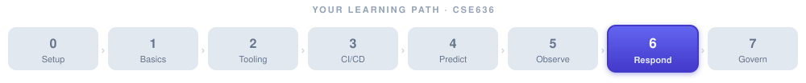

# Week 6 — Demo: A No-Code Incident-Response Agent in n8n



> 🧭 **Optional visual demo for Week 6.** The [Python + MCP lab](week-06-lab.md) builds the *same* incident-triage agent in code. This page builds it **visually, with no code**, in [n8n](https://n8n.io) — a node-based automation tool — so you can *see* the perceive → decide → act loop as boxes and wires before (or instead of) writing it in Python. For the concepts behind it, see **[week-06-notes.md](week-06-notes.md)**.

> 🎯 **At a glance**
>
> | | |
> |---|---|
> | **You'll need** | n8n (Docker or desktop), a local [Ollama](https://ollama.com) server with `llama3.1` pulled. *Optional:* a running Prometheus, Gmail/Telegram credentials |
> | **You'll build** | An importable workflow: Schedule → Prometheus check → `If` → **AI Agent** (Ollama model + memory + 9 tools) → notify |
> | **Runs offline** | Yes — the Prometheus call ships **pinned** with a mock alert, and the notify nodes are disabled, so you can execute it with only Ollama running |
> | **Ties to notes** | [The ReAct loop](week-06-notes.md#concept-the-react-reasoning-loop), [approval gates & blast radius](week-06-notes.md#concept-levels-of-autonomy--blast-radius-control), [ITSM/on-call integration](week-06-notes.md#concept-itsm-and-on-call-integration) |
> | **Files** | [`../../project/n8n/incident-response-agent.json`](../../project/n8n/incident-response-agent.json) + [`README.md`](../../project/n8n/README.md) |

---

## What You Will Build

![A no-code incident-response workflow in n8n. Top lane (perceive → decide): a Schedule trigger fires every 5 minutes into an HTTP Request node that queries Prometheus, which feeds an If node asking "alert firing?". The If node's false branch goes to a "Record healthy — nothing to do" box; its true branch goes to an Edit Fields node that builds an incident prompt, which flows down into a central AI Agent node running a ReAct loop (reason → tool → observe). The AI Agent sends to a dashed, disabled Notify box (Gmail · Telegram). Below the AI Agent sits "the agent's brain": an Ollama Chat Model (local LLM llama3.1) attached as the model, a Simple Memory node with a custom session key attached as memory, and a box of 9 tools — each an n8n Code node (mock): Incident Analyzer, Decision Router, Human Review (gated), Log Analyzer, CD Analyzer, Deal Action, Reporter Tool, Docker Restart (destructive), and Approval (gated). Lock icons mark human-in-the-loop gates; a warning icon marks the destructive Docker Restart that requires approval first.](images/n8n-incident-workflow.svg)

This is the same shape as the [coded lab](week-06-lab.md): a scheduled **perceive** step (poll Prometheus), a **decide** step (`If` — is anything firing?), and an **act** step (an AI Agent that reasons with tools) — with **destructive actions kept behind a human gate**. The difference is you build it by dragging nodes instead of writing Python.

---

## Step 1 — Get n8n and Ollama running

```bash
# n8n (quickest: Docker)
docker run -it --rm -p 5678:5678 -v n8n_data:/home/node/.n8n docker.n8n.io/n8nio/n8n
# open http://localhost:5678

# Ollama (the agent's model)
ollama serve            # if not already running
ollama pull llama3.1
```

Open **http://localhost:5678** and create the local owner account.

<details><summary>✅ Did it work?</summary>

You should see the empty n8n canvas at `http://localhost:5678`, and `ollama list` should show `llama3.1`. If Ollama isn't running, the AI Agent node will fail later with a connection error to `localhost:11434`.

</details>

---

## Step 2 — Import the workflow

1. In n8n: **Workflows → ⋮ (top-right) → Import from File**.
2. Choose [`project/n8n/incident-response-agent.json`](../../project/n8n/incident-response-agent.json).
3. You'll see the graph from the diagram above appear on the canvas.

Add the **Ollama credential** on the *Ollama Chat Model* node (base URL `http://localhost:11434`; from inside a container use `http://host.docker.internal:11434`).

---

## Step 3 — Run it and read the output

Click **Execute workflow** (bottom center).

The **HTTP Request** node is **pinned** (purple 📌) with a mock *firing* alert, so it does **not** need a live Prometheus. That mock drives the `If` node down its **true** branch → the agent triages.

**Where to look** (click a node to open its INPUT / OUTPUT panels, left→right):

| Node | What you should see |
|---|---|
| HTTP Request | the pinned `data.result[]` alert (📌) |
| If | the item leaving the **true** output |
| Edit Fields | `status: anomaly_detected` and a built `prompt` |
| **AI Agent** | `output`: the agent's incident summary ← **the result** |

To watch the agentic loop itself (model calls + tool calls), open the **AI Agent** node and look at the **Logs** panel.

<details><summary>✅ Check your understanding — prove the loop ran</summary>

A correct run shows:

- **AI Agent → OUTPUT** has an `output` string describing the incident and a recommended action.
- **AI Agent → Logs** shows at least one **Ollama Chat Model** call. Ideally you also see **tool** calls (Incident Analyzer, Log Analyzer, …).
- **If** routed the item out its **true** branch (proving the pinned alert drove the decision).

> ⚠️ **Pitfall — small models skip tools.** Smaller Ollama models sometimes answer directly instead of calling tools, so you may see `output` populated but few/no tool calls. That's a model-capability limit, not a workflow bug. Use `llama3.1` (8B) or larger, or swap in an *Anthropic Chat Model*.

</details>

---

## Step 4 — Connect a real Prometheus (optional)

1. Click the **HTTP Request** node → **Unpin** its output (removes the 📌 mock).
2. Set the URL so it's reachable **from where n8n runs** (see the Docker note below).
3. Query tip: `ALERTS{alertstate="firing"}` returns firing alerts (needs alerting rules); use `up` if you just want to confirm connectivity — but note `up` is always non-empty, so the `If` will always take the **true** branch.

> ⚠️ **Pitfall — `localhost` inside Docker.** If n8n runs in a container, `localhost:9090` means *the n8n container itself*, not your host or the Prometheus container — you'll get **"The service refused the connection - perhaps it is offline"** even though Prometheus is fine.
>
> | How things run | URL to use |
> |---|---|
> | n8n + Prometheus on the **same Docker network** | `http://<prometheus-container-name>:9090/...` |
> | n8n in Docker, Prometheus on the **host** (Mac/Windows) | `http://host.docker.internal:9090/...` |
> | n8n **native**, Prometheus in Docker | `http://localhost:9090/...` — only if the container publishes `-p 9090:9090` |
>
> Confirm from inside the container before editing the node:
> `docker exec -it <n8n-container> sh` then `wget -qO- 'http://host.docker.internal:9090/api/v1/query?query=up'` — whichever address returns JSON is the one to paste in.

---

## How this maps to the course concepts

| Diagram element | Week 6 concept |
|---|---|
| Schedule → HTTP → `If` | **Perceive → decide** — the trigger and detection half of the loop |
| AI Agent (ReAct) + tools | **Act** — the agent reasons and calls tools ([the ReAct loop](week-06-notes.md#concept-the-react-reasoning-loop)) |
| 🔒 Human Review / Approval tools | **Approval gate** — human-in-the-loop before irreversible action |
| ⚠️ Docker Restart (mock/dry-run) | **Blast-radius control** — the destructive action is gated and defaults to a dry-run |
| 📣 Notify (Gmail/Telegram) | **ITSM / on-call integration** — closing the loop with humans |

The tools are **mock Code nodes** on purpose — the point of the demo is the *shape* of a gated agent. Making them real (a live log query, a Docker API call, a Slack approval-and-wait) is exactly the [assignment](week-06-lab.md#assignment-self-healing-microservice-with-agent-driven-triggers).

<details><summary>💬 Discussion — code vs. no-code agents</summary>

**Q:** The [Python lab](week-06-lab.md) and this n8n demo build the same gated triage agent. When would you reach for each in a real org?

**A:** No-code tools like n8n win for **fast prototyping, visibility, and non-engineer collaborators** — you can *see* the loop and hand it to an on-call lead to tweak. Code wins for **testability, version control, complex logic, and least-privilege packaging** (e.g., MCP servers with tightly-scoped tools). A common pattern: prototype the flow visually, then harden the risky parts (the destructive tools, the approval gate) in code with real tests. Both must keep the same guardrail — **no irreversible action without a human gate.**

</details>

---

## Recap and Looking Ahead

You built the Week 6 incident-response agent **without writing code** — a scheduled Prometheus check feeding an AI Agent that triages with a model, memory, and nine tools, with destructive actions held behind a human gate. Same loop, same guardrails as the [coded lab](week-06-lab.md), just visual.

Next, [Week 7](../week-07/week-07-notes.md) turns from *responding* to *governing* — agentic Infrastructure-as-Code, security, and the policies that keep all of this safe at scale.
